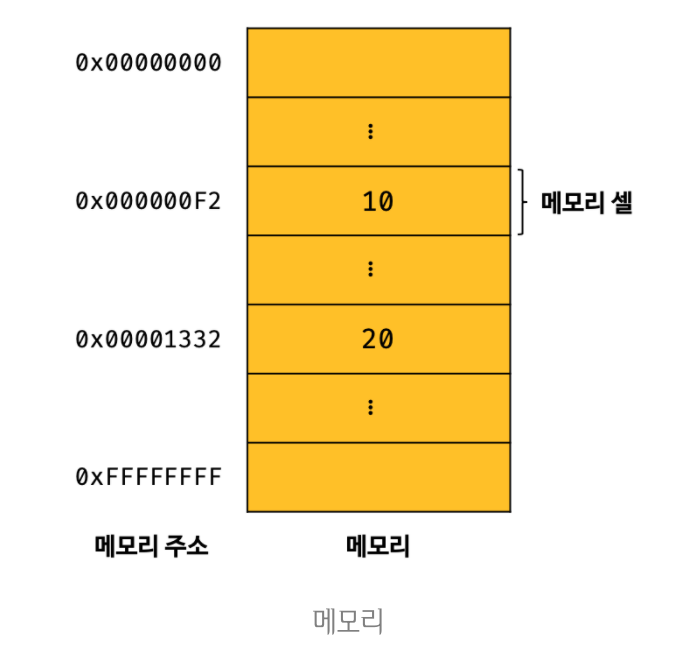
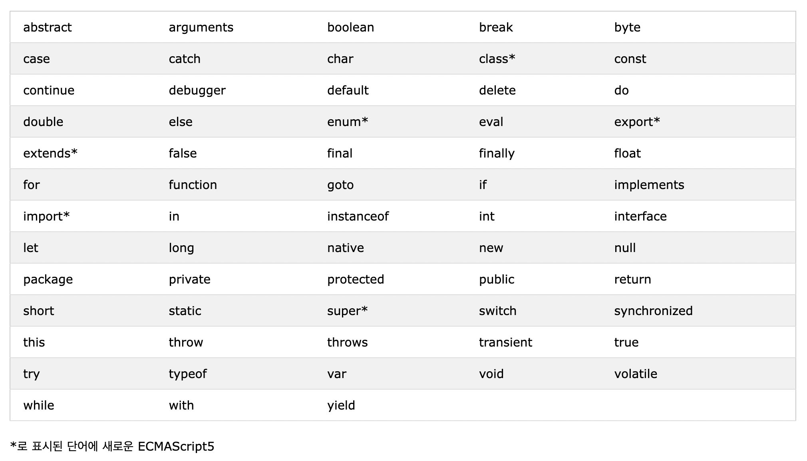

# 04. 변수
## 04-1. 변수란 무엇인가? 왜 필요한가?

```javascript
10 + 20
```

자바스크립트 엔진이 위 코드를 계산하려면 먼저 10, 20, +라는 기호(리터럴과 연산자)의 의미를 알고 있어야 햐며, 10 + 20이라는 식의 의미도 해석(파싱)할 수 있어야 한다. <br><br>
자바스크립트 엔진지 10 + 20이라는 식의 의미를 해석하려면 + 연산을 수행하기 위해 먼저 + 연산자의 좌변과 우변의 숫자 값, 즉 피연산자를 기억한다. 컴퓨터는 CPU를 사용해서 연산하고, 메모리를 사용해서 데이터를 기억한다. <br><br>
메모리는 데이터를 저장할 수 있는 메모리 셀의 집합체이다. 메모리 셀 하나의 크기는 1바이트이며, 컴퓨터는 메모리 셀의 크기, 즉 1바이트 단위로 데이터를 저장하거나 읽어들인다. <br><br>
<p align="center"></p> <br>
숫자 값 10과 20은 메모리 상의 임의의 위치(메모리 주소)에 기억(저장)되고 CPU는 이 값을 읽어 연산을 수행한다. 연산 결과로 생성된 숫자 값 30도 메모리 상의 임의의 위치에 저장된다. 메모리 상에 저장되는 모든 값은 2진수로 저장된다.<br><br>
성공적으로 연산이 끝났으나, 이대로라면 연산 결과로 나온 30을 재사용할 수 없다. 연산 결과 30을 재사용하고 싶다면 메모리 주소를 통해 30이 저장된 메모리에 직접 접근을 해야 한다. 하지만 메모리 주소를 통해 값에 직접 접근하는 것은 치명적인 오류를 발생시킬 가능성이 높기 떄문에 이는 올바른 방법이 아니다. 따라서 저장된 값을 읽어 들여 재사용하기 위해 '변수'가 필요하다. <br><br>
<strong>변수(variable)란, 하나의 값을 저장하기 위해 확보한 메모리 공간 자체 또는 그 메모리 공간을 식별하기 위해 붙인 이름</strong>을 말한다. 간단히 말하면, 변수는 프로그래밍 언어에서 값을 저장하고 참조하는 메커니즘으로, <strong>값의 위치를 가리키는 상징적인 이름</strong>이다. <br><br>

```javascript
// 값을 하나 저장하기 위한 변수 선언
var userId = 1;
var userName = "김윤";

// 객체나 배열을 사용하여 여러 값을 하나로 그룹화하여 사용할 수 있음
var user = {id: 1, name: '김윤'};
var users =[
     {id: 1, name: '김윤'},
     {id: 2, name: '김도은'},
     {id: 3, name: '최이서'}
]
```

```javascript
var result = 10 + 20;
```
위의 코드는 10 + 20이라는 연산을 통해 생성된 값 30을 메모리 공간에 저장한다. 이 때 메모리 공간에 저장된 값을 식별할 수 있는 고유한 이름(예: result)을 변수명이라 한다. 그리고 변수에 저장된 값(예: 30)을 변수 값이라고 한다. 변수에 값을 저장하는 것을 <b>할당</b>이라 하고, 변수에 저장된 값을 읽어 들이는 것을 <b>참조</b>라 한다. <br><br>

## 04-2. 식별자
변수 이름을 식별자라고도 한다. <strong>식별자는 어떤 값을 식별할 수 있는 고유한 이름</strong>을 말한다. 식별자는 값이 아니라 메모리 주소를 기억하고 있다. 식별자로 값을 구별한다는 것은 식별자가 기억하고 있는 메모리 주소를 통해 메모리 공간에 저장된 값에 저장할 수 있다는 의미이다. <br><br>
식별자라는 용어는 변수 이름에만 국한해서 사용하지 않는다. 변수, 함수, 클래스 등의 이름은 모두 식별자다. 변수, 함수, 클래스 등의 이름과 같은 식별자는 네이밍 규칙을 준수해야 하며, <b>선언</b>에 의해 자바스크립트 엔진에 식별자의 존재를 알린다. <br><br>

## 04-3. 변수 선언
변수 선언이란 변수를 생성하는 것을 말한다. 좀 더 자세히 말하면 값을 저장하기 위한 메모리 공간을 확보하고 변수 이름과 확보된 메모리 공간의 주소를 연결해서 값을 저장할 수 있게 준비하는 것이다. <br><br>
<strong>변수를 사용하려면 반드시 선언이 필요하다. 변수를 선언할 때는 var, let, const 키워드를 사용한다.</strong> 원래는 var만 있었으나, var는 블록 레벨 스코프를 지원하지 않고 함수 레벨 스코프를 지원한다는 점 때문에 의도치 않게 전역 변수가 선언되어 부작용이 발생하기도 한다. 이로 인해 let, const가 도입되었다. <br><br>

```javascript
var score; // 변수 선언
```

위의 코드는 변수를 선언하고, 아직 값을 할당하지 않았다. 이 때 메모리 공간을 비어 있는 것으로 생각할 수 있으나 자바스크립트 엔진에 의해 undefined로 초기화된다. undefined란 자바스크립트에서 제공하는 원시 타입의 값이다. 초기화란 변수가 선언된 이후 최초로 값을 할당하는 것을 말한다. 만약 초기화 단계를 거치지 않으면 확보된 메모리 공간에는 이전에 다른 애플리케이션이 사용했던 쓰레기 값이 나올 수 있다. <br><br>

변수를 사용하려면 반드시 선언이 필요하다. 변수 뿐만 아니라 모든 식별자가 그렇다. 만약 선언하지 않은 식별자에 접근하면 참조 에러가 발생한다. <br><br>

## 04-4. 변수 선언의 실행 시점과 변수 호이스팅
```javascript
console.log(score); // undefined
var score; // 변수 선언문
```

자바스크립트 코드는 인터프리터에 의해 한 줄씩 실행되므로 순차적으로 실행될 것이라 생각하기 때문에 해당 코드를 실행하면 에러가 발생할 것처럼 보인다. 하지만 참조 에러가 발생하지 않고 undefined가 출력된다. 그 이유는 <strong>변수 선언이 소스코드가 한 줄씩 순차적으로 실행되는 시점, 즉 런타임이 아니라 그 이전 단계에서 먼저 실행되기 때문이다.</strong> <br><br>

자바스크립트 엔진은 변수 선언이 소스 코드의 어디에 있든 상관없이 다른 코드보다 먼저 실행한다. 따라서 변수 선언이 소스코드의 어디에 위치하는지와 상관없이 어디서든지 변수를 참조할 수 있다. 이처럼 <strong>변수 선언문이 코드의 선두로 끌어 올려진 것처럼 동작하는 자바스크립트 고유의 특징을 변수 호이스팅</strong>이라 한다. <br><br>

## 04-5. 값의 할당
```javascript
var score; // 변수 선언
score = 80; // 값의 할당

var score = 80; // 변수 선언과 값의 할당
```

변수에 값을 할당할 때는 할당 연산자 '='를 사용한다. 변수 선언과 값의 할당을 2개의 문으로 나누어 표현한 코드와 1개의 문으로 단축 표현한 코드는 정확히 동일하게 동작한다. 즉, 자바스크립트 엔진은 변수 선언과 값의 할당을 단축 표현해도 2개의 문으로 나누어 각각 실행한다. 이때 주의할 점은 변수 선언과 할당의 실행 시점이 다르다는 것이다. <strong>변수 선언은 소스코드가 순차적으로 실행되는 시점인 런타임 이전에 먼저 실행되지만 값의 할당은 소스코드가 순차적으로 실행되는 시점인 런타임에 실행된다.</strong> <br><br>

```javascript
console.log(score); // undefined

var score;
score = 80;

console.log(score); // 80
```

변수 선언은 런타임 이전에 먼저 실행되고 값의 할당은 런타임에 실행된다. 따라서 score 변수에 값을 할당하는 시점에는 이미 변수 선언이 완료된 상태이며, undefined로 초기화되어 있다. 따라서 score 변수에 값을 할당하면 score 변수의 값은 undefined에서 새롭게 할당한 숫자 값 80으로 변경(재할당)된다. <br><br>

## 04-6. 값의 재할당
```javascript
var score = 80; // 변수 선언과 값의 할당
score = 90; // 값의 재할당
```

var 키워드로 선언한 변수는 재할당할 수 있다. 재할당은 이미 값이 할당되어 있는 변수에 새로운 값을 또다시 할당하는 것을 말한다. 만약 <strong>값을 재할당할 수 없어서 변수에 저장된 값을 변경할 수 없다면 변수가 아니라 상수라 한다.</strong> 이 떄 const 키워드를 사용하여 변수를 선언한다. <br><br>

재할당으로 인해 필요없는 값(예 : undefined, 80)은 가비지 콜렉터에 의해 메모리에서 자동으로 해제된다. 자바스크립트는 매니지드 언어이기 때문에 가비지 콜렉터가 더 이상 사용하지 않는 메모리의 해제를 수행한다.

## 04-7. 식별자 네이밍 규칙
- 식별자는 특수 문자를 제외한 문자, 숫자, 언더스코어(_), 달러 기호($)를 포함할 수 있다.
- 단, 식별자는 특수 문자를 제외한 문자, 언더스코어(_), 달러 기호($)로 시작해야 한다. 숫자로 시작하는 것은 허용하지 않는다.
- 예약어는 식별자로 사용할 수 없다. <br><br>
<p align="center"></p> <br>

```javascript
// 변수 이름 사용 가능, 하나의 구문에 변수 여러 개 선언 권장 X
var person, $elem, _name, first_name, val1

// 유니코드 문자 허용(한글, 일본어 가능)하지만 권장 X
var 이름;

// 규칙 위배로 사용 불가
var first-name;
var 1st;
var this;

// 자바스크립트 변수명은 대소문자 구별
var firstname;
var firstName;
var FIRSTNAME;
```

자바스크립트는 일반적으로 변수나 함수의 이름에는 카멜 케이스(예 : firstName)를 사용하고, 생성자 함수, 클래스의 이름에는 파스칼 케이스(예 : FirstName)를 사용한다.