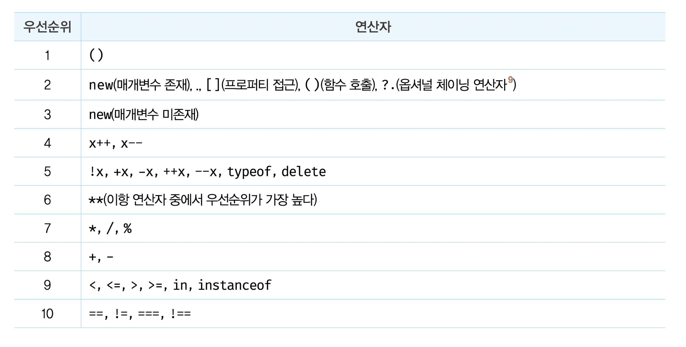
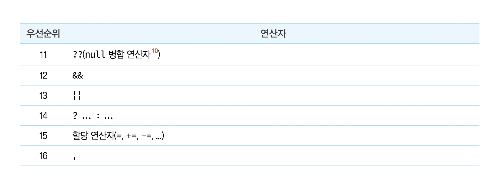

# 16장 프로퍼티 어트리뷰트

## 16.1 내부 슬롯과 내부 메서드

내부 슬롯과 내부 메서드는 ECMAScript사양에서 사용하는 의사 프로퍼티와 의사 메서드다. 즉, ECMAScript 사양에서 등장하는 [[]]로 감싼 이름들이 내부 슬롯과 내부 메서드이다. -> ECMAScript 문서에서 자바스크립트 내부 동작의 설명을 위해 정의해 놓은 가상 메소드
```javascript
const o = {};
o. [[Prototype]] // Uncaught SyntaxError: Unexpected token '[ ’
o.__proto__ // Object.prototype
```

<br>

## 16.2 프로퍼티 어트리뷰트와 프로퍼티 디스크립터 객체
프로퍼티를 생성할 때 자바스크립트 엔진은 프로퍼티의 상태를 나타내는 property attribute를 기본값으로 자동 정의 

property attribute : 자바스크립트 엔진이 관리하는 내부 상태 값인 내부 슬롯 [[Value]].[[Writable]].[[Enumerable]].[[Configurable]]이다.
직접 접근은 불가능 하지만 지만 Object.getOwnPropertyDescriptor 메서드를 사용하여 간접적으로 확인이 가능
Object.getOwnPropertyDescriptor -> 프로퍼티 디스크립터 객체를 반환, 존재 안할 경우 undefined를 반환

```javascript
const person = {
name: 'Park'
};

// 프로퍼티 동적 생성
person.age = 28;

// 모든 프로퍼티의 프로퍼티 어트리뷰트 정보를 제공하는 프로퍼티 디스크립터 객체들을 반환한다.
console.log(Object.getOwnPropertyDescriptors(person));
/*
{
name: {value: "Park", writable: true, enumerable: true, configurable: true},
age: {value: 28, writable: true, enumerable: true, configurable: true}
}   //첫 번째 매개변수 : 객체의 참조, 두번째 매개변수 : 프로퍼티 키
*/

```

<br>

## 16.3 데이터 프로퍼티와 접근자 프로퍼티
프로퍼티 -> 데이터 프로퍼티 / 접근자 프로퍼티

데이터 프로퍼티 : 키와 값으로 구성된 일반적인 프로퍼티
접근자 프로퍼티 : 자체적으로는 값을 갖지 않고 다른 데이터 프로퍼티의 값을 읽거나 저장할 때 호출되는 접근자 함수로 구성된 프로퍼티

#### 16.3.1 데이터 프로퍼티
|프로퍼티 어트리뷰트|프로퍼티 디스크립터 객체의 프로퍼티|설명|
|-------|-------|---------------------|
|[[Value]]|value|프로퍼티 키를 통해 프로퍼티 값에 접근하면 반환되는 값|
|[[Writable]]|writable|프로퍼티 값의 변경 가능 여부를 불리언 값으로 가짐. false -> 읽기 전용 프로퍼티|
|[[Enumerable]]|enumerable|열거 가능 여부를 불리언 값으로 가짐. fales -> for ... in 문이나 Object. keys 메서드 등으로 열거 불가능|
|[[Configurable]]|configurable|프로퍼티의 재정의 가능 여부를 불리언 값으로 가짐. false -> 해당 프로퍼티 삭제, 변경 금지|

#### 16.3.2 접근자 프로퍼티
|프로퍼티 어트리뷰트|프로퍼티 디스크립터 객체의 프로퍼티|설명|
|-------|-------|---------------------|
|[[Get]]|get||
|[[Set]]|set||
|[[Enumerable]]|enumerable||
|[[Configurable]]|configurable||

<br>

## 7.4 삼항 조건 연산자
삼항 조건 연산자 : 조건식의 평가 결과에 따라 반환할 값을 결정
조건식 ? (true일때 반환할 값) : (false일때 반환할 값)
```javascript
var x = 2;

var result = x % 2 ? '홀수' : '짝수'; // 짝수
```
삼항 조건 연산자는 if...else 문과 비슷하다. 하지만 if...else문은 표현식이 아닌 문이므로 값처럼 사용 불가능하다.
삼항 조건 연산자 표현식은 값으로 평가할 수 있는 표현식인 문이다.

<br>

## 7.5 논리 연산자
논리 연산자는 우항과 좌항의 피연산자를 논리 연산한다.(AND, OR, NOT)
```javascript
// 논리합 연산자
true || true; // true
true || false; // true
false || false; // false

// 논리곱 연산자
true && true; // true
true && false; // false
false && false; // false

// 논리 부정 연산자
!true; // false

// 논리 부정 연산자는 언제나 불리언 값을 반환하지만
// 논리합 논리곱 연산자의 평과 결과는 불리언 값이 아닐 수도 있다.
!0; // true
!'Hello'; // false
'Cat' && 'Dog' // 'Dog'

// 드 모르간의 법칙 : 논리곱(합)의 부정은 각각 부정의 논리합(곱)과 같다는 법칙
!(x || y) === (!x && !y)
!(x && y) === (!x || !y)
```

<br>

## 7.6 쉼표 연산자
쉼표 연산자 : 쉼표 연산자는 왼쪽 피연산자 부터 평가하고 마지막 피연산자의 평가가 끝나면 마지막 피연산자의 평과 결과를 반환한다.
```javascript
var x;

x = (2, 3);
console.log(x); // 3
```

<br>

## 7.7 그룹 연산자
그룹 연산자 : 소괄호()로 피연산자를 감싸는 그룹 연산자는 자신의 피연산자인 표현식을 가장 먼저 평가한다.
<p align="center"></p> 
<br>

```javascript
2 + 2 * 2; // 6
(2 + 2) * 2; // 8
```

<br>

## 7.8 typeof 연산자
typeof 연산자 : 피연산자의 데이터 타입을 문자열로 변환한다.
```javascript
typeof ''  // string
typeof 1 // number
typeof NaN // number
typeof true // boolean
typeof undefined // undefined
typeof Symbol() // symbol
typeof null // object *null이 아닌것은 버그이다
typeof [] // object 
typeof {} // object 
typeof new Data() // object 
typeof /test/gi // object 
typeof function () {} // function

//선언하지 않은 식별자를 typeof연산자로 연산하면 undefined을 반환한다.
```

<br>

## 7.9 지수 연산자
지수 연산자 : 좌항의 피연산자를 밑으로, 우항의 피연산자를 지수로 거듭제곱하여 반환한다.
```javascript
2 ** 2; // 4
2 ** 2.5; // 5.656854
2 ** 0; // 1
2 ** -2; // 0.25
(-2) ** 2 // 4 (음수를 거듭제곱의 밑으로 사용하려면 괄호로 묶어야 한다)

// 지수 연산자 대신 math.pow 사용도 가능하다

// 지수 연산자는 이항 연산자 중에서 우선순위가 가장 높다.
2 * 5 ** 2; // 50
```

<br>

## 7.10 연산자의 부수 효과
부수 효과가 있는 연산자는 할당 연산자(=), 증감 연산자(++/--),delete 연산자이다.
```javascript
var o = {a : 1};

delete o.a; // delete 연산자는 객체의 프로퍼티를 삭제함
console.log(o); // {}
```

<br>

## 7.11 연산자의 우선순위
연산자 우선순위 : 여러 개의 연산자로 이뤄진 문일 경우 연산자가 실행 되는 순서

<br>



<br>

## 7.12 연산자의 결합 순서
연산자 결합 순서 : 연산자의 좌항 or 우항 중 어디서부터 평가를 수행할 것인지를 나타내는 순서

<br>

