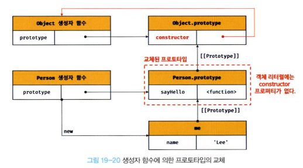
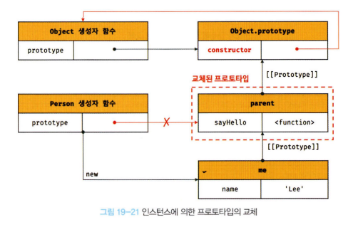

# 19장 프로토타입

## 19.8 오버라이딩과 프로퍼티 섀도잉

> 오버라이딩 : 상위 클래스가 가지고 있는 메서드를 하위 클래스가 재정의하여 사용하는 방식이다.

> 오버로딩 : 함수의 이름은 동일하지만 매개변수의 타입 또는 개수가 다른 메서드를 구현하고 매개변수에 의해 메서드를 구별하여 호출하는 방식이다. 자바스크립트는 오버로딩을 지원하지 않지만 arguments 객체를 사용하여 구현할 수는 있다.

```javascript
const Person = (function () {
// 생성자 함수
  function Person(name) {
  this.name = name;
}

// 프로토타입 메서드
Person.prototype.sayHello = function () {
  console.log( Hi! My name is ${this.name} );
};

// 생성자 함수를 반환
  return Person;
}());

const me = new Person('Park');

// 인스턴스 메서드
me.sayHello = function () {
  console.log( Hey! My name is ${this.name} );
};

// 인스턴스 메서드가 호출된다. 프로토타입 메서드는 인스턴스 메서드에 의해 가려진다.
me.sayHello(); // Hey! My name is Park

// 인스턴스 메서드를 삭제한다.
delete me.sayHello;
// 인스턴스에는 sayHello 메서드가 없으므로 프로토타입 메서드가 호출된다.
me.sayHello(); // Hi! My name is Park

// 프로토타입 체인을 통해 프로토타입 메서드가 삭제되지 않는다.
delete me.sayHello;
// 프로토타입 메서드가 호출된다.
me.sayHello(); // Hi! My name is Park

// 하위 객체를 통해 프로토타입의 프로퍼티를 변경 또는 삭제하는 것은 불가능하다.
// 즉, 하위객체를 통해 프로토타입에 get 액세스는 허용되나 set 액세스는 허용되지 않는다.

// 프로토타입 메서드 삭제
delete Person.prototype.sayHello;
me.sayHello(); // TypeError: me. sayHello is not a function

//프로토타입 프로퍼티를 변경 또는 삭제하려면 하위 객체를 통해 프로토타입 체인으로 접근하는 것이 아니라 프로토타입에 직접 접근해야 한다.
```
프로토타입 프로퍼티와 같은 이름의 프로퍼티를 인스턴스에 추가시 프로토타입 프로퍼티를 덮어쓰는 것이 아니라 인스턴스 프로퍼티로 추가한다.

즉, sayHello는 프로토타입 메서드 sayHello를 오버라이딩했고 프로토타입 메서드 sayHello는 가려진다.

상속 관계에 의해 프로퍼티가 가려지는 현상을 프로퍼티 섀도잉이라 한다.

<br>

## 19.9 프로토타입의 교체
부모 객체인 프로토타입을 동적으로 변경할 수 있다. 이러한 특징을 활용해 객체 간의 상속관계를 동적으로 변경할수 있다.

프로토타입은 생성자 함수 또는 인스턴스에 의해 교체할 수 있다.

#### 19.9.1 생성자 함수에 의한 프로토타입의 교체
```javascript
const Person = (function () {
  function Person(name) {
  this.name = name;
}


// 1 생성자 함수의 prototype 프로퍼티를 통해 프로토타입을 교체
Person.prototype = {
  sayHello() {
    console.log('Hi! My name is ${this.name}');
  }
};
  return Person;
}());
const me = new Person('Park');

// 프로토타입을 교체하면 constructor 프로퍼티와 생성자 함수 간의 연결이 파괴된다.
console.log(me.constructor === Person); // false
// 프로토타입 체인을 따라 Object.prototyped constructor 프로퍼티가 검색된다.
console.log(me.constructor === Object); // true
```
<p align="center"></p>
프로토타입으로 교체한 객체 리터럴에는 constructor 프로퍼티가 없다.

constructor 프로퍼티는 자바스크립트 엔진이 프로토타입을 생성할 때 암묵적으로 추가한 프로퍼티다.

따라서 me 객체의 생성자 함수를 검색하면 Person이 아닌 Object가 나온다.

프로토타입을 교체하면 constructor 프로퍼티와 생성자 함수 간의 연결이 파괴되지만 프로토타입으로 교체한 객체 리터럴에
constructor 프로퍼티를 추가하면 프로토타입의 constructor 프로퍼티를 되살릴 수 있다.
```javascript
const Person = (function () {
  function Person(name) {
  this.name = name;
}
// 생성자 함수의 prototype 프로퍼티를 통해 프로토타입을 교체
Person.prototype = {
  // constructor 프로퍼티와 생성자 함수 간의 연결을 설정
  constructor: Person,
  sayHello() {
    console.log('Hi! My name is ${this.name}');
    }
  };
  return Person;
}());

const me = new Person('Park');

// constructor 프로퍼티가 생성자 함수를 가리킨다.
console.log(me.constructor === Person); // true
console.log(me.constructor === Object); // false
```
#### 19.9.2 인스턴스에 의한 프로토타입의 교체
프로토타입은 생성자 함수의 prototype 프로퍼티뿐만 아니라 인스턴스의 __proto__ 접근자 프로퍼티를 통해 접근할 수 있다.

따라서 인스턴스의 __proto__ 접근자 프로퍼티를 통해 프로토타입을 교체할 수 있다.
```javascript
function Person(name) {
  this.name = name;
}
const me = new Person('Park');
// 프로토타입으로 교체할 객체
const parent = {
sayHello() {
  console.log('Hi' My name is ${this.name} );
  }
};
// me 객체의 프로토타입을 parent 객체로 교체한다.
Object.setPrototypeOf(me, parent);
// 위 코드는 아래의 코드와 동일하게 동작한다.
// me.__proto__ = parent;

me.sayHello(); // Hi! My name is Park

// 프로토타입을 교체하면 constructor 프로퍼티와 생성자 함수 간의 연결이 파괴된다.
console.log(me.constructor === Person); // false
// 프로토타입 체인을 따라 Object.prototype의 constructor 프로퍼티가 검색된다.
console.log(me.constructor === Object); // true
```
<p align="center"></p>
파괴된 생성자 함수와 프로토타입 간의 연결을 되살리려면 프로토타입으로 교체한 객체 리터럴에 constructor 프로퍼티를 추가하고 생성자 함수의 prototype 프로퍼티를 재설정하면 된다.

```javascript
function Person(name) {
  this.name = name;
}
const me = new Person('Park');

// 프로토타입으로 교체할 객체
const parent = {
  // constructor 프로퍼티와 생성자 함수 간의 연결을 설정
  constructor: Person,
  sayHello() {
    console.log( Hi! My name is ${this.name} );
  }
};

// 생성자 함수의 prototype 프로퍼티와 프로토타입 간의 연결을 설정
Person.prototype = parent;

// me 객체의 프로토타입을 parent 객체로 교체한다.
Object.setPrototypeOf(me, parent);
// 위 코드는 아래의 코드와 동일하게 동작한다.
// me.__proto__ = parent;

me.sayHello(); // Hi! My name is Park

// constructor 프로퍼티가 생성자 함수를 가리킨다.
console.log(me.constructor === Person); // true
console.log(me.constructor === Object); // false

// 생성자 함수의 prototype 프로퍼티가 교체된 프로토타입을 가리킨다.
console.log(Person.prototype === Object.getPrototypeOf(me)); // true
```

<br>

## 19.10 instanceof 연산자

instanceof 연산자 : 이항 연산자로서 좌변에 객체를 가리키는 식별자, 우변에 생성자 함수를 가리키는 식별자를 피 연산자로 받는다.
(우변의 피 연산자가 함수가 아닌 경우 TypeError가 발생한다. )

> 객체 instanceof 생성자 함수

```javascript
// 생성자 함수
function Person(name) {
  this.name = name;
}

const me = new Person('Park');

// Person.prototype me 객체의 프로토타입 체인 상에 존재하므로 true로 평가된다.
console.log(me instanceof Person); // true
// Object.prototype me 객체의 프로토타입 체인 상에 존재하므로 true로 평가된다.
console.log(me instanceof Object); // true

// 프로토타입으로 교체할 객체
const parent = {};

// 프로토타입의 교체
Object.setPrototypeOf(me, parent);

// Person 생성자 함수와 parent 객체는 연결되어 있지 않다.
console.log(Person.prototype === parent); // false
console.log(parent.constructor === Person); // false

// Person.prototype me 객체의 프로토타입 체인 상에 존재하지 않기 때문에 false로 평가된다.
console.log(me instanceof Person); // false
// Object.prototype me 객체의 프로토타입 체인 상에 존재하므로 true로 평가된다.
console.log(me instanceof Object); // true

// parent 객체를 Person 생성자 함수의 prototype 프로퍼티에 바인딩한다.
Person.prototype = parent;
console.log(me instanceof Person); // true
```
Person.prototype이 me 객체의 프로토타입 체인 싱에 존재하지 않기 때문에 me instanceof Person은 false로 평가된다.
하지만 parent 객체를 Person 생성자 함수의 prototype 프로퍼티에 바인딩해서 true로 평가되었다.

프로토타입이 교체되어 constructor 프로퍼티와 생성자 함수 간의 연결이 파괴되어도 생성자 함수의 prototype 프로퍼티와 프로토타입 간의 연결은 파괴되지 않으므로 instanceof는 아무런 영향을 받지 않는다.

<br>

## 19.11 직접 상속

#### 19.11.1 Object.create에 의한 직접 상속

Object.create 메서드는 명시적으로 프로토타입을 지정하여 새로운 객체를 생성한다.

```javascript
/**
* 지정된 프로토타입 및 프로퍼티를 갖는 새로운 객체를 생성하여 반환한다.
* @param {Object} prototype - 생성할 객체의 프로토타입으로 지정할 객체
* @param {Object} [propertiesObject] - 생성할 객체의 프로퍼티를 갖는 객체
* ©returns {Object} 지정된 프로토타입 및 프로퍼티를 갖는 새로운 객체
*/
Object.create(prototype[, propertiesObject])

// 프로토타입이 null인 객체를 생성한다. 생성된 객체는 프로토타입 체인의 종점에 위치한다.
// obj → null
let obj = Object.create(null);
console.log(Object.getPrototypeOf(obj) === null); // true
// Object.prototyped 상속받지 못한다.
console.log(obj.toString()); // TypeError

// obj → Object.prototype → null
// obj = {};와 동일하다.
obj = Object.create(Object.prototype);
console.log(Object.getPrototypeOf(obj) === Object.prototype); // true

// obj → Object.prototype → null
// obj = { x : 1 };와 동일하다.
obj = Object.create(Object.prototype, {
  x: { value: 1, writable: true, enumerable: true, configurable: true }
});
// 위 코드는 아래와 동일하다.
// obj = Object.create(Object.prototype);
// obj.x = 1;
console.log(obj.x); // 1
console.log(Object.getPrototypeOf(obj) === Object.prototype); // true

const myProto = { x: 10 };
// 임의의 객체를 직접 상속받는다.
// obj → myProto → Object.prototype → null
obj = Object.create(myProto);
console.log(obj.x); // 10
console.log(Object.getPrototypeOf(obj) === myProto); // true

// 생성자 함수
function Person(name) {
  this.name = name;
}
// obj → Person.prototype → Object.prototype → null
// obj = new Person('Park')와 동일하다.
obj = Object.create(Person.prototype);
obj.name = 'Park';
console.log(obj.name); // Park
console.log(Object.getPrototypeOf(obj) === Person.prototype); // true
```
Object.create 메서드의 장점은
> - new 연산자가 없이도 객체를 생성할 수 있다.
> - 프로토타입을 지정하면서 객체를 생성할 수 있다.
> - 객체 리터럴에 의해 생성된 객체도 상속받을 수 있다.
#### 19.11.2 객체 리터럴 내부에서 __proto__에 의한 직접 상속

```javascript

```

<br>

## 19.12 정적 프로퍼티/메서드


#### 16.5.1 객체 확장 금지

```javascript

```

#### 16.5.2 객체 밀봉

#### 16.5.3 객체 동결

#### 16.5.4 불변 객체

<br>

## 19.13 프로퍼티 존재 확인
