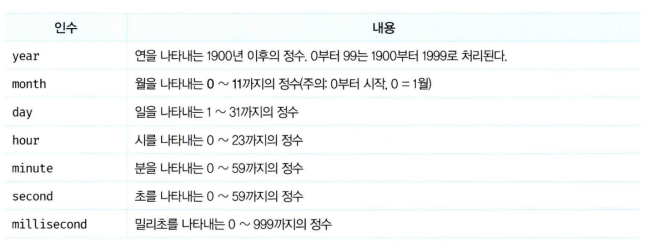

# 30장 Date 🕥

Date는 날짜와 시간을 위한 메서드를 제공하는 빌트인 객체이면서 생성자 함수이다.

## 30.1 Date 생성자 함수

Date는 생성자 함수다. Date 생성자 함수로 생성한 Date 객체는 내부적으로 날짜와 시간을 나타내는 정수값을 갖는다.
Date 생성자 함수로 생성한 Date 객체는 현재 날짜와 시간을 나타내는 정수값을 가진다.

#### 30.1.1 new Date()

인수 없이 new 연산자와 함께 호출하면 현재 날짜와 시간을 가지는 Date 객체를 반환한다.

Date 객체는 내부적으로 날짜와 시간을 나타내는 정수값을 갖지만 Date 객체를 콘솔에 출력하면 기본적으로 날짜와 시간 정보를 출력한다.

new 연산자 없이 호출하면 Date 객체를 반환하지 않고 날짜와 시간 정보를 나타내는 문자열을 반환한다.

```javascript
new Date(); // Mon Apr 08 2024 23:51:29 GMT+0900 (한국 표준시)
Date(); // 'Mon Apr 08 2024 23:51:29 GMT+0900 (한국 표준시)'
```

#### 30.1.2 new Date(milliseconds)

Date 생성자 함수에 밀리초를 인수로 전달하면 1970년 1월 1일 00:00:00(UTC)을 기점으로 인수로 전달된 밀리초만큼 경과한 날짜와 시간을 나타내는 Date 객체를 반환한다.

```javascript
new Date(0); // Thu Jan 01 1970 09:00:00 GMT+0900 (한국 표준시)

// 86400000ms == 하루
new Date(86400000); // Fri Jan 02 1970 09:00:00 GMT+0900 (한국 표준시)
```

#### 30.1.3 new Date(dateString)

Date 생성자 함수에 날짜와 시간을 나타내는 문자열을 인수로 전달하면 지정된 날짜와 시간을 나타내는 Date 객체를 반환한다. 이때 인수로 전달한 문자열은 Date.parse 메서드에 의해 해석 가능한 형식이어야 한다.

```javascript
new Date('Apr 28, 2024 10:00:00');
// Sun Apr 28 2024 10:00:00 GMT+0900 (한국 표준시)
new Date('2024/04/28/10:00:00');
// Sun Apr 28 2024 10:00:00 GMT+0900 (한국 표준시)
```

#### 30.1.4 new Date(year, month[, day, hour, minute, second, millisecond])

Date 생성자 함수에 연, 월, 일, 시, 분, 초, 밀리초를 의미하는 숫자를 인수로 전달하면 지정된 날짜와 시간을 나타내는 Date 객체를 반환한다.

```javascript
new Date(2024, 3); // Mon Apr 01 2024 00:00:00 GMT+0900 (한국 표준시)
new Date(2024, 3, 8, 10, 00, 00, 0); // Mon Apr 08 2024 10:00:00 GMT+0900 (한국 표준시)
```
<p align="center"></p> 

<br>

## 30.2 Date 메서드

#### 30.2.1 Date.now

1970년 1월 1일 00:00:00(UTC)을 기점으로 현재 시간까지 경과한 밀리초를 숫자로 반환한다.

```javascript
Date.now(); // 1712589017266
```

#### 30.2.2 Date.parse

1970년 1월 1일 00:00:00(UTC)을 기점으로 인수로 전달된 지정 시간까지의 밀리초를 숫자로 반환한다.

```javascript
// UTC
Date.parse('Jan 2, 1970 00:00:00 UTC');// 86400000

// KST
Date.parse('Jan 2, 1970 09:00:00'); // 86400000

// KST
Date.parse('1970/01/02/09:00:00'); // 86400000
```

#### 30.2.3 Date.UTC

Date.parse와 같지만 Date.UTC 메서드의 인수는 로컬 타임(KST)이 아닌 UTC로 인식된다.

```javascript
Date.UTC(1970, 0, 2); // 86400000
Date.UTC('1970/1/2'); // NaN
```

#### 30.2.4 Date.prototype.getFullYear

Date 객체의 연도를 나타내는 정수를 반환한다.

```javascript
new Date('2024/04/08').getFullYear(); // 2024
```

#### 30.2.5 Date.prototype.setFullYear

Date 객체에 연도를 나타내는 정수를 설정한다. 연도 이외에 옵션으로 월, 일도 설정할 수 있다.

```javascript
const today = new Date();

// 년도 지정
today.setFullYear(2024);
today.getFullYear(); // 2024

// 년도/월/일 지정
today.setFullYear(1997, 6, 9);
today.getMonth(); // 6
today.getDate(); // 9
```

#### 30.2.6 Date.prototype.getMonth

Date 객체의 월을 나타내는 0 〜 11의 정수를 반환한다. 1월 → 0, 12월 → 11

```javascript
new Date('2024/04/08').getMonth(); // 3
```

#### 30.2.7 Date.prototype.setMonth

Date 객체에 월을 나타내는 0 〜 11의 정수를 설정한다. 월 이외에 옵션으로 일도 설정할 수 있다.

```javascript
const today = new Date();

// 월 지정
today.setMonth(0); // 1월
today.getMonth(); // 0

// 월/일 지정
today.setMonth(5, 9); // 6월 9일
today.getMonth(); // 5 
```

#### 30.2.8 Date.prototype.getDate

Date 객체의 날짜(1 〜 31)를 나타내는 정수를 반환한다.

```javascript
new Date('2024/06/09').getDate(); // 9
```

#### 30.2.9 Date.prototype.setDate

Date 객체에 날짜(1 〜 31)를 나타내는 정수를 설정한다.

```javascript
const today = new Date();

// 날짜 지정
today.setDate(9);
today.getDate(); // 9
```

#### 30.2.10 Date.prototype.getDay

Date 객체의 요일(0 〜 6)을 나타내는 정수를 반환한다.

|요일|일|월|화|수|목|금|토|
|---|---|---|---|---|---|---|---|
|반환값|0|1|2|3|4|5|6|

```javascript
new Date('2024/04/08').getDay(); // 1 (월요일)
```

#### 30.2.11 Date.prototype.getHours

Date 객체의 시간(0 ~ 23)을 나타내는 정수를 반환한다.

```javascript
new Date('2024/04/08/12:00').getHours(); // 12
```

#### 30.2.12 Date.prototype.setHours

Date 객체에 시간(0 ~ 23)을 나타내는 정수를 설정한다. 시간 이외에 옵션으로 분, 초, 밀리초도 설정할 수 있다.

```javascript
const today new Date();

// 시간 지정
today.setHours(7);
today.getHours(); // 7

// 시간/분/초/밀리초 지정
today setHours(0, 0, 0, 0); // 00:00:00:00
today getHours(); // 0
```

#### 30.2.13 Date.prototype.getiviinutes

Date 객체의 분(0 ~ 59)을 나타내는 정수를 반환한다.

```javascript
new Date('2024/04/08/12:30').getMinutes(); // 30
```

#### 30.2.14 Date.prototype.setiviin나tes

Date 객체에 분(0 ~ 59)을 나타내는 정수를 설정한다. 분 이외에 옵션으로 초, 밀리초도 설정할 수 있다.

```javascript
const today = new Date();

// 분 지정
today.setMinutes(50);
today.getMinutes(); // 50

// 분/초/밀리초 지정
today.setMinutes(5, 10, 999); // HH:05:10:999
today.getMinutes(); // 5
```

#### 30.2.15 Date.prototype.getSeconds

Date 객체의 초(0 ~ 59)를 나타내는 정수를 반환한다.

```javascript
new Date('2024/04/08/12:30:10').getSeconds(); // 10
```

#### 30.2.16 Date.prototype.setSeconds

Date 객체에 초(0 ~ 59)를 나타내는 정수를 설정한다. 초 이외에 옵션으로 밀리초도 설정할 수 있다.

```javascript
const today = new Date();

// 초 지정
today.setSeconds(30);
today.getSeconds(); // 30

// 초/밀리초 지정
today.setSeconds(10, 0); // HH:MM:10:000
today.getSeconds(); // 10
```

#### 30.2.17 Date.prototype.getMilliseconds

Date 객체의 밀리초(0 ~ 999)를 나타내는 정수를 반환한다.

```javascript
new Date('2024/04/08/12:30:10:150').getMilliseconds(); // 150
```

#### 30.2.18 Date.prototype.setMilliseconds

Date 객체에 밀리초(0 ~ 999)를 나타내는 정수를 설정한다.

```javascript
const today = new Date();

// 밀리초 지정
today.setMilliseconds(123);
today.getMilliseconds(); // 123
```

#### 30.2.19 Date.prototype.getTime

1970년 1 월 1일 00:00:00(UTC)를 기점으로 Date 객체의 시간까지 경과된 밀리초를 반환한다.

```javascript
new Date('2024/04/08/12:30').getTime(); // 1712547000000
```

#### 30.2.20 Date.prototype.setTime

Date 객체에 1970년 1월 1일 00:00:00(UTC)를 기점으로 경과된 밀리초를 설정한다.

```javascript
const today = new Date();

// 1970년 1월 1일 00:00:00(UTC)를 기점으로 경과된 밀리초 설정
today.setTime(1712547000000); 
console.log(today); // Mon Apr 08 2024 12:30:00 GMT+0900 (한국 표준시)
```

#### 30.2.21 Date.prototype.getTimezoneOffset

UTC와 Date 객체에 지정된 로컬 시간과의 차이를 *분* 단위로 반환한다.

KST는 UTC에 9시간을 더한 시간이다. 즉, UTC = KST - 9(시간) 이다.

```javascript
const today = new Date(); // today의 지정 로캘은 KST다.

//UTC와 today의 지정 로캘 KST와의 차이는 -9시간이다.

today.getTimezoneOffset() / 60; // -9
```

#### 30.2.22 Date.prototype.toDateString

사람이 읽을 수 있는 형식의 문자열로 Date 객체의 날짜를 반환한다.

```javascript
const today = new Date('2024/4/08/12:30');

today.toString(); // 'Mon Apr 08 2024 12:30:00 GMT+0900 (한국 표준시)'
today.toDateString(); // 'Mon Apr 08 2024'
```

#### 30.2.23 Date.prototype.toTimeString

사람이 읽을 수 있는 형식으로 Date 객체의 시간을 표현한 문자열을 반환한다.

```javascript
const today = new Date('2024/4/08/12:30');

today.toTimeString(); // '12:30:00 GMT+0900 (한국 표준시)'
```

#### 30.2.24 Date.prototype.toISOString

ISO 8601 형식으로 Date 객체의 날짜와 시간을 표현한 문자열을 반환한다.

```javascript
const today = new Date('2024/4/08/12:30');

today.toISOString(); // '2024-04-08T03:30:00.000Z'
today.toISOString().slice(0, 10); // '2024-04-08'
today.toISOString().slice(0, 10).replace(/-/g,''); // '20240408'
```

#### 30.2.25 Date.prototype.toLocaleString

인수로 전달한 로캘을 기준으로 Date 객체의 날짜와 시간을 표현한 문자열을 반환한다. 인수를 생략한 경우 브라우저가 동작 중인 시스템의 로캘을 적용한다.

```javascript
const today = new Date('2024/4/08/12:30');

today.toLocaleString(); '2024. 4. 8. 오후 12:30:00'
today.toLocaleString('ko-KR'); // '2024. 4. 8. 오후 12:30:00'
today.toLocaleString('en-US'); // '4/8/2024, 12:30:00 PM'
today.toLocaleString('ja-JP'); // '2024/4/8 12:30:00'
```

#### 30.2.26 Date.prototype.toLocaleTimeString

인수로 전달한 로캘을 기준으로 Date 객체의 시간을 표현한 문자열을 반환한다. 인수를 생략한 경우 브라우저가 동작 중인 시스템의 로캘을 적용한다.

```javascript
const today = new Date('2024/4/08/12:30');

today.toLocaleTimeString(); // '오후 12:30:00'
today.toLocaleTimeString('ko-KR'); // '오후 12:30:00'
today.toLocaleTimeString('en-US'); // '12:30:00 PM'
today.toLocaleTimeString('ja-JP'); // '12:30:00'
```

<br>

## 30.3 Date를 활용한 시계 예제 

```javascript
(function printNow() {
  const today = new Date();

  const dayNames = [
    '(일요일)',
    '(월요일)',
    '(화요일)',
    '(수요일)',
    '(목요일)',
    '(금요일)',
    '(토요일)'
  ];

  // getDay 메서드는 해당 요일(0 ~ 6)을 나타내는 정수를 반환한다.
  const day = dayNames[today.getDay()];
  const year = today.getFullYear();
  const month = today.getMonth() + 1;
  const date = today.getDate();
  let hour = today.getHours();
  let minute = today.getMinutes();
  let second = today.getSeconds();
  const ampm = hour >= 12 ? 'PM' : 'AM';

  // 12시간제로 변경
  hour %= 12;
  hour = hour || 12 ; // hour가 0이면 12를 재할당

  // 10 미만인 분과 초를 2자리로 변경
  minute = minute < 10 ? '0' + minute : minute;
  second = second < 10 ? '0' + second : second;

  const now = `${year}년 ${month}월 ${date}일 ${day} ${hour}:${minute}:${second}${ampm}`;

  console.log(now);

  // 1초마다 printNow 함수를 재귀 호출한다.
  setTimeout(printNow, 1000);
}());

// 2024년 4월 9일 (화요일) 12:56:47AM
// 2024년 4월 9일 (화요일) 12:56:48AM
// 2024년 4월 9일 (화요일) 12:56:49AM
...
```
