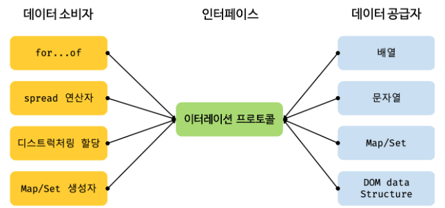

# 34장 이터러블 🔁

## 34.1 이터레이션 프로토콜

> 이터레이션 프로토콜 : 순회 가능한 자료구조를 만들기 위해 미리 약속된 규칙

<br>

이터레이션 프로토콜에는 두가지 프로토콜이 있습니다.

1. 이터러블 프로토콜
2. 이터레이터 프로토콜

이터레이션 프로토콜을 준수한 객체는

1. for…of 문으로 순회 가능
2. Spread 문법의 피연산자가 될 수 있다

#### 34.1.1 이터러블

> 이터러블 : 이터러블 프로토콜을 준수한 객체

이터러블은 Symbol.iterator를 프로퍼티 키로 사용한 메서드를 직접 구현하거나 프로토타입 체인을 통해 상속받은 객체를 말한다.

```javascript
// 이터러블인지 확인하는 함수 구현
const isIterable = v => v !== null && typeof v[Symbol.iterator] === 'function';
// Symbol.iterator는 객체가 반복 가능한지를 나타냄

// 배열, 문자열, Map, Set 등은 이터러블
isIterable([]); // true
isIterable(''); // true
isIterable(new Map()); // true
isIterable(new Set()); // true
isIterable({}); // false

// 배열은 Array.prototype의 Symbol.iterator 메서드를 상속받는 이터러블이다.
const array = [1, 2, 3];

console.log(Symbol.iterator in array); // true

// 이터러블인 배열은 for... of 문으로 순회 가능하다.
for (const item of array) {
  console.log(item);
}

// 이터러블인 배열은 스프레드 문법의 대상으로 사용할 수 있다.
console.log([…array]); // [l, 2, 3]

// 이터러블인 배열은 배열 디스트럭처링 할당의 대상으로 사용할 수 있다.
const [a, …rest] = array;
console.log(a, rest); // 1, [2, 3]
```

반대로 이터러블이 아닌 것들은 for ... of 문으로 순회할 수 없으며 스프레드 문법과 배열 디스트럭처링 할당의 대상으로 사용할 수 없다.

```javascript
const obj = { a: 1, b: 2 };

// 일반 객체는 Symbol.iterator 메서드를 구현하거나 상속받지 않는다.
// 따라서 일반 객체는 이터러블 프로토콜을 준수한 이터러블이 아니다.
console.log(Symbol.iterator in obj); // false

// 이터러블이 아닌 일반 객체는 for... of 문으로 순회할 수 없다.
for (const item of obj) { // TypeError: obj is not iterable
  console.log(item);
}

// 이터러블이 아닌 일반 객체는 배열 디스트럭처링 할당의 대상으로 사용할 수 없다.
const [a, b] = obj; // TypeError: obj is not iterable

// 단 스프레드 프로퍼티 제안은 객체 리터럴 내부에서 스프레드 문법의 사용을 허용한다.
console.log({ ... obj }); // { a: 1, b: 2 }
```

#### 34.1.2 이터레이터

> 이터레이터 : 이터레이터 프로토콜을 준수한 객체

이터레이터는 next 메서드를 가지고 있어야 하며, next 메서드를 호출할 때마다 순회할 때의 다음 값을 가진 객체를 반환해야 한다.

```javascript
// 배열은 이터러블 프로토콜을 준수한 이터러블이다.
const array = [1, 2, 3];

// Symbol.iterator 메서드는 이터레이터를 반환한다.
const iterator = array[Symbol.iterator]();

// Symbol.iterator 메서드가 반환한 이터레이터는 next 메서드를 갖는다.
console.log('next' in iterator); // true

// next 메서드를 호출하면 이터러블을 순회하며 순회 결과를 나타내는 이터레이터 리절트 객체를 반환한다.
// 이터레이터 리절트 객체는 value와 done 프로퍼티를 갖는 객체다.
console.log(iterator.next()); //{ value: 1, done: false }
console.log(iterator.next()); //{ value: 2, done: false }
console.log(iterator.next()); //{ value: 3, done: false }
console.log(iterator.next()); //{ value: undefined, done: true }
```

value는 현재 순회 중인 값이며, done은 순회가 끝났는지를 나타내는 불리언 값이다.

<br>

## 34.2 빌트인 이터러블

자바스크립트는 이터레이션 프로토콜을 준수한 객체인 빌트인 이터러블을 제공한다.
|빌트인 이터러블|Symbol.iterator 메서드|
|--|--|
|Array|	Array.prototype[Symbol.iterator]|
|String|	String.prototype[Symbol.iterator]|
|Map|	Map.prototype[Symbol.iterator]|
|Set|	Set.prototype[Symbol.iterator]|
|TypedArray|	TypedArray.prototype[Symbol.iterator]|
|arguments|	arguments[Symbol.iterator]|
|DOM 컬렉션|	NodeList.prototype[Symbol.iterator], HTMLCollection.prototype[Symbol.iterator]|

<br>

## 34.3 for … of 문

> for ... of 문 : 이터러블을 순회하면서 이터러블의 요소를 변수에 할당

```javascript
for (let item of [1,2,3]) {
	console.log(item); // 1 2 3
}
```

> for ... in 문 : 프로퍼티 어트리뷰트 [[Enumerable]] 의 값이 true인 프로퍼티를 순회하며 열거한다. 이때 프로퍼티 키가 심벌인 프로퍼티는 열거하지 않는다.

```javascript
for (let item in [1,2,3]) {
	console.log(item); // 0 1 2
}
```

for... of 문의 내부 동작을 for 문으로 표현하면 다음과 같다.

```javascript
const iterable = [1, 2, 3];

// 이터러블의 Symbol.iterator 메서드를 호출하여 이터레이터를 생성한다.
const iterator = iterable[Symbol.iterator]();

for (;;) {
// 이터레이터의 next 메서드를 호출하여 이터러블을 순회한다.
// 이때 next 메서드는 이터레이터 리절트 객체를 반환한다.
const res = iterator.next();

// next 메서드가 반환한 이터레이터 리절트 객체의 done프로퍼티 값이 true이면 이터러블의 순회를 중단한다.
if(res.done) break;

// 이터레이터 리절트 객체의 value 프로퍼티 값을 item 변수에 할당한다.
const item = res.value;
console.log(item); // 1 2 3
}
```

<br>

## 34.4 이터러블과 유사 배열 객체

> 유사 배열 객체 : 마치 배열처럼 인덱스로 프로퍼티 값에 접근할 수 있고 length 프로퍼티를 갖는 객체

유사 배열 객체는 length 프로퍼티를 갖기 때문에 for 문으로 순회할 수 있고, 인덱스를 나타내는 숫자 형식의 문자열을 프로퍼티 키로 가지므로 마치 배열처럼 인덱스로 프로퍼티 값에 접근할 수 있다.

```javascript
// 유사 배열 객체
const arrayLike = {
  0: 1,
  1: 2,
  2: 3,
  length: 3
};

// 유사 배열 객체는 length 프로퍼티를 갖기 때문에 for 문으로 순회할 수 있다.
for (let i = 0; i < arrayLike.length; i++) {
// 유사 배열 객체는 마치 배열처럼 인덱스로 프로퍼티 값에 접근할 수 있다.
  console.log(arrayLike[i]); // 1 2 3
}

// 유사 배열 객체는 이터러블이 아니기 때문에 for... of 문으로 순회할 수 없다.(일반 객체)
for (const item of arrayLike) {
  console.log(item); // 1 2 3
}
// TypeError: arrayLike is not iterable

// Array.from은 유사 배열 객체 또는 이터러블을 배열로 변환한다.
const arr = Array.from(arrayLike);
console.log(arr); // [1, 2, 3]
```

ES6에서 유사 배열 객체인 arguments, NodeList, HTMLCollection 객체에 Symbol.iterator 메서드를 구현하여 이터러블이 되었다. 하지만 이터러블이 된 이후에도 length 프로퍼티를 가지며 인덱스로 접근할 수 있는 것에는 변함이 없으므로 유사 배열 객체이면서 이터러블인 것이다.

배열은 ES6 에 도입된 Array.from 메서드를 사용하여 유사 배열 객체 또는 이터러블을 배열로 변환할 수 있다.

<br>

## 34.5 이터레이션 프로토콜의 필요성

<p align="center"></p> 

다양한 데이터 소스(ex : Array, String, Map, Set ...)가 각자의 순회 방식을 갖는다면 데이터 소비자(for…of 문, spread 문법)는 다양한 데이터 소스의 순회 방식을 모두 지원해야 하고 이는 효율적이지 않다. 하지만 다양한 데이터 소스가 이터레이션 프로토콜을 준수하도록 규정하면 데이터 소비자는 이터레이션 프로토콜만을 지원하도록 구현하면 된다.

즉, 이터레이션 프로토콜은 다양한 데이터 소스가 하나의 순회 방식을 갖도록 규정하여 데이터 소비자가 효율적으로 다양한 데이터 소스를 사용할 수 있도록 **데이터 소비자와 데이터 소스를 연결하는 인터페이스의 역할을 한다.**

<br>

## 34.6 사용자 정의 이터러블

#### 34.6.1 사용자 정의 이터러블 구현

일반 객체도 이터레이션 프로토콜을 준수하도록 구현하면 사용자 정의 이터러블이 된다.

```javascript
// 피보나치 수열을 구현한 사용자 정의 이터러블
const fibonacci = {

// Symbol.iterator 메서드를 구현하여 이터러블 프로토콜을 준수한다.
[Symbol.iterator]() {
	let [pre, cur] = [0, 1];
	const max = 10; // 수열의 최대값

	// Symbol.iterator 메서드는 next 메서드를 소유한 이터레이터를 반환해야 하고
	// next 메서드는 이터레이터 리절트 객체를 반환해야 한다.
	return {
		next() {
			[pre, cur] = [cur, pre + cur];
			// 이터레이터 리절트 객체를 반환한다.
			return { value: cur, done: cur >= max };
			}
		};
	}
};

// 이터러블인 fibonacci 객체를 순회할 때마다 next 메서드가 호출된다.
for (const num of fibonacci) {
	console.log (num); // 1 2 3 5 8
}
```

#### 34.6.2 이터러블을 생성하는 함수

```javascript

```

#### 34.6.3 이터러블이면서 이터레이터인 객체를 생성하는 함수

```javascript

```

#### 34.6.4 무한 이터러블과 지연 평가

```javascript

```
