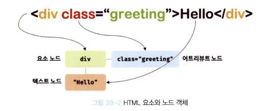
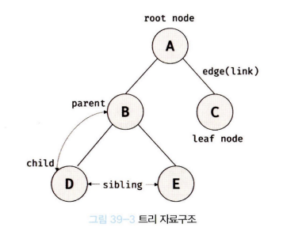
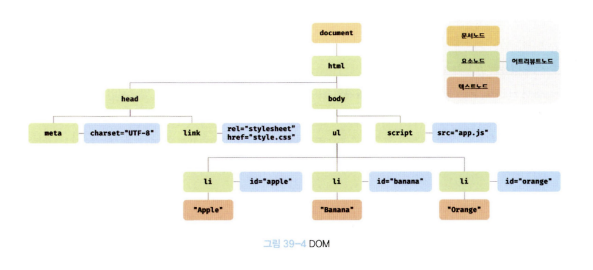
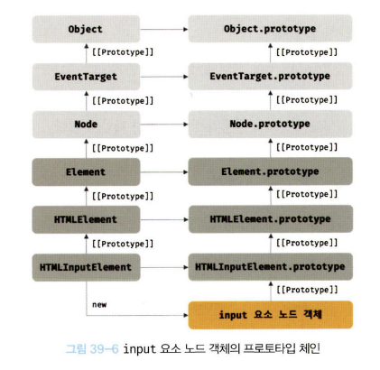
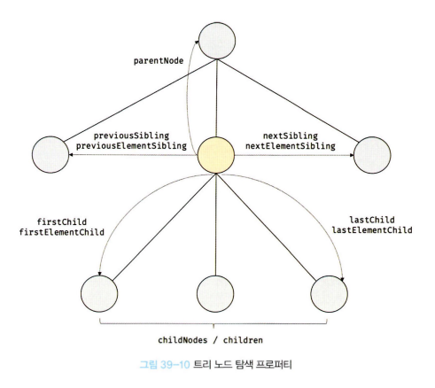
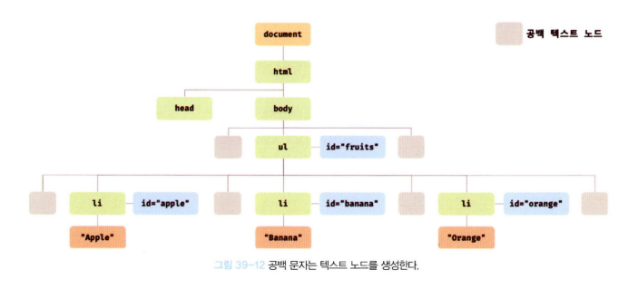
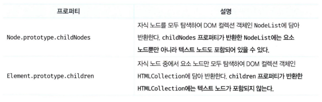
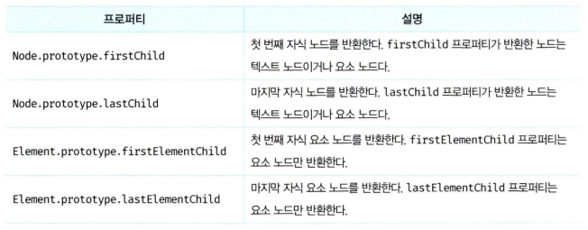
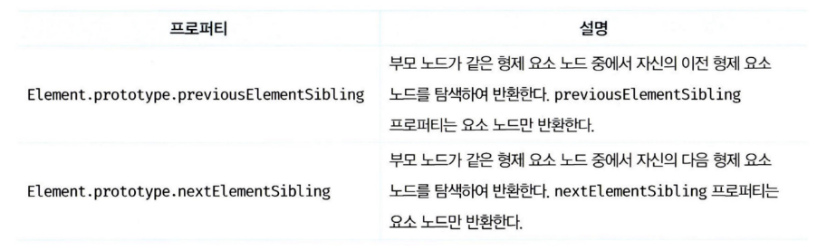
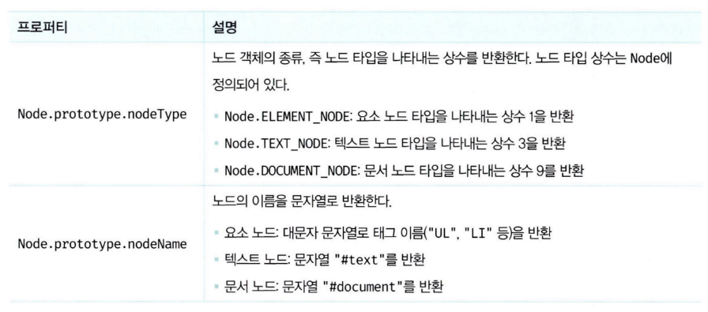

# 39. DOM
브라우저의 렌더링 엔진은 HTML 문서를 파싱하여 브라우저가 이해할 수 있는 자료구조인 DOM을 생성한다. **DOM(Document Object Model)은 HTML 문서의 계층적 구조와 정보를 표현하며 이를 제어할 수 있는 API, 즉 프로퍼티와 메서드를 제공하는 트리 자료구조다.**

## 39-1. 노드
### 1️⃣ HTML 요소와 노드 객체
<p align="center"></p>

HTML 요소는 렌더링 엔진에 의해 파싱되어 DOM을 구성하는 요소 노드 객체로 변환된다. 이때 HTML 요소의 어트리뷰트는 어트리뷰트 노드로, HTML 요소의 텍스트 콘텐츠는 텍스트 노드로 변환된다.

<p align="center"></p>

HTML 문서는 HTML 요소들의 집합으로 이뤄지며, HTML 요소는 중첩 관계를 갖는다. 이때 HTML 요소 간에는 중첩 관계에 의해 계층적인 부자 관계가 형성된다. 이러한 HTML 요소의 부자 관계를 반영하여 HTML 요소를 객체화한 모든 노드 객체들을 트리 자료 구조로 구성한다.

#### 트리 자료구조
<p align="center"></p>

트리 구조란 부모 노드와 자식 노드로 구성되어 노드 간의 계층적 구조를 표현하는 비선형 자료구조를 말한다. **노드 객체들로 구성된 트리 자료구조를 DOM이라 한다.** 노드 객체의 트리로 구조화되어 있기 때문에 DOM을 **DOM 트리**라고 부르기도 한다.

### 2️⃣ 노드 객체의 타입
```html
<!DOCTYPE html>
<html>
    <head>
        <meta charset="UTF-8">
        <link rel="stylesheet" href="style.css">
    </head>
    <body>
        <ul>
            <li id="apple">Apple</li>
            <li id="banana">Banana</li>
            <li id="orange">Orange</li>
        </ul>
        <script src="app.js"></script>
    </body>
</html>
```

위의 HTML 문서를 렌더링 엔진이 파싱한다고 하자.

<p align="center"></p>

렌더링 엔진은 HTML 문서를 파싱하여 위와 같이 DOM을 생성한다.

#### 문서 구조
DOM 트리의 최상위에 존재하는 루트 노드로서 document 객체를 가리킨다. 브라우저 환경의 모든 자바스크립트 코드는 script 태그에 의해 분리되어 있어도 하나의 전역 객체 window를 공유한다. HTML 문서당 document 객체는 유일하다. 또한 요소, 어트리뷰트, 텍스트 노드에 접근하려면 문서 노드를 통해야 한다.

#### 요소 노드
HTML 요소를 가리킨다. 요소 노드는 HTML 요소 간의 중첩에 의해 부자 관계를 가지고, 이를 통해 문서의 구조를 표현한다.

#### 어트리뷰트 노드
HTML 요소의 어트리뷰트를 가리킨다. 어트리뷰트가 지정된 HTML 요소의 요소 노드와 연결되어 있지만, 부모 노드와 연결되어 있지 않다. 따라서 어트리뷰트 노드에 접근하여 어트리뷰트를 참조하거나 변경하려면 먼저 요소 노드에 접근해야 한다.

#### 텍스트 노드
HTML 요소의 텍스트를 가리킨다. 문서의 정보를 표현한다고 할 수 있다. 요소 노드의 자식 노드이며, 자식 노드를 가질 수 없는 리프 노드다. 따라서 텍스트 노드에 접근하려면 먼저 부모 노드인 요소 노드에 접근해야 한다.

### 3️⃣노드 객체의 상속 구조
DOM은 HTML 문서의 계층적 구조와 정보를 표현하며, 이를 제어할 수 있는 API, 즉 프로퍼티와 메서드를 제공하는 트리 자료구조이다. 즉, DOM을 구성하는 노드 객체는 자신의 구조와 정보를 제어할 수 있는 DOM API를 사용할 수 있다.

DOM을 구성하는 노드 객체는 브라우저 환경에서 추가적으로 제공하는 호스트 객체다. 하지만 노드 객체도 자바스크립트 객체이므로 프로토타입에 의한 상속 구조를 갖는다.

<p align="center"></p>

모든 노드 객체는 Object, EventTarget, Node 인터페이스를 상속받는다. 추가적으로 문서 노드는 Document, HTMLDocument 인터페이스를 상속받고 어트리뷰트 노드는 Attr, 텍스트 노드는 CharacterDatat 인터페이스를 각각 상속받는다.

요소 노드는 Element 인터페이스를 상속받는다. 또한 요소 노드는 추가적으로 HTMLElement와 태그의 종류별로 세분화된 HTMLHtmlElement, HTMLHeadElement, HTMLBodyElement, HTMLUListElement 등의 인터페이스를 상속받는다.

이를 프로토타입 체인 관점에서 살펴보자. input 요소를 파싱하여 객체화한 input 요소 노드 객체는 HTMLInputElement, HTMLElement, Element, Node, EventTarget, Object의 prototype에 바인딩되어 있는 프로토타입의 객체를 상속받는다. 즉, input 요소 노드 객체는 프로토타입 체인에 있는 모든 프로토타입의 프로퍼티나 메서드를 상속받아 사용할 수 있다.

<p align="center"></p>

노드 객체에는 노드 객체의 종류, 즉 노드 타입에 상관없이 모든 노드 객체가 공통으로 갖는 기능도 있고, 노드 타입에 따라 고유한 기능도 있다.

HTML 요소가 객체화된 노드 객체는 HTML 요소가 갖는 공통적인 기능이 있다. 하지만 요소 노드 객체는 HTML 요소의 종류에 따라 고유한 기능도 있다. 이처럼 노드 객체는 공통된 기능일수록 프로토타입 체인의 상위에, 개별적인 고유 기능일수록 프로토타입 체인의 하위에 프로토타입 체인을 구축하여 노드 객체에 필요한 기능, 즉 프로퍼티와 메서드를 제공하는 상속 구조를 갖는다.

**DOM은 HTML 문서의 계층적 구조와 정보를 표현하는 것은 물론 노드 객체의 종류, 즉 노드 타입에 따라 필요한 기능을 프로퍼티와 메서드의 집합인 DOM API로 제공한다. 이 DOM API를 통해 HTML의 구조나 내용 또는 스타일 등을 동적으로 조작할 수 있다.**

중요한 것은 DOM API, 즉 DOM이 제공하는 프로퍼티와 메서드를 사용하여 노드에 접근하고 HTML의 구조나 내용 또는 스타일 등을 동적으로 변경하는 방법을 익히는 것이다.

## 39-2. 요소 노드 취득
HTML의 구조나 내용 또는 스타일 등을 동적으로 조작하려면 먼저 요소 노드를 취득해야 한다. 요소 노드의 취득은 HTML 요소를 조작하는 시작점이다. 이를 위해 DOM은 요소 노드를 취득할 수 있는 다양한 메서드를 제공한다.

### 1️⃣ id를 이용한 요소 노드 취득
```html
<!DOCTYPE html>
<html>
    <body>
        <ul>
            <li id="apple">Apple</li>
            <li id="banana">Banana</li>
            <li id="orange">Orange</li>
        </ul>
        <script>
            const $elem = document.getElementById('apple');
            $elem.style.color = 'red';
        </script>
    </body>
</html>
```
Document.prototype.getElementById 메서드는 인수로 전달한 id 어트리뷰트 값을 갖는 하나의 요소 노드를 탐색하여 반환한다.

id 값은 HTML 문서 내에서 유일한 값이어야 하며, 여러 개의 값을 가질 수 없다. 단, HTML 문서 내에 중복된 id 값은을 갖는 HTML 요소가 여러 개 존재하더라도 어떠한 에러도 발생하지 않는다. 즉, HTML 문서 내에는 중복된 id 값을 갖는 요소가 여러 개 존재할 가능성이 있다. 이러한 경우 getElementByID 메서드는 인수로 전달된 값이 di 값을 갖는 첫 번째 요소 노드만 반환한다.

만약 인수로 전달된 id 값을 갖는 HTML 요소가 존재하지 않는 경우 getElementById 메서드는 null을 반환한다.

HTML 요소에 id 어트리뷰트를 부여하면 id 값과 동일한 이름의 전역 변수가 암묵적으로 선언되고 해당 노드 객체가 할당되는 부수 효과가 있다. 단, id 값과 동일한 이름의 전역 변수가 이미 선언되어 있으면 이 전역 변수에 노드 객체가 재할당되지 않는다.

### 2️⃣ 태그 이름을 이요한 요소 노드 취득
```html
<!DOCTYPE html>
<html>
    <body>
        <ul>
            <li id="apple">Apple</li>
            <li id="banana">Banana</li>
            <li id="orange">Orange</li>
        </ul>
        <script>
            const $elems = document.getElementByTagName('li');
            [...$elems].forEach(elem => { elem.style.color = 'red'; });
        </script>
    </body>
</html>
```
Document.prototype/Element.prototype.getElementsByTagName 메서드는 인수로 전달한 태그 이름을 갖는 모든 요소 노드들을 탐색하여 반환한다. 함수는 하나의 값만 반환할 수 있으므로 여러 개의 값을 반환하려면 배열이나 객체와 같은 자료구조에 담아 반환해야 한다. getElementsByTagName 메서드가 반환하는 DOM 컬렉션 객체인 HTMLCollection 객체는 유사 배열 객체이면서 이터러블이다.

HTML 문서의 모든 요소 노드를 취득하려면 getElementsByTagName 메서드의 인수로 '*'를 전달한다.

getElementsByTagName 메서드는 Document.prototype에 정의된 메서드와 Element.prototype에 정의된 메서드가 있다.전자는 DOM의 루트 노드인 문서 노드, 즉 document를 통해 호출하며 DOM 전체에서 요소 노드를 탐색하여 반환한다. 하지만 후자는 특정 요소 노드를 통해 호출하며, 특정 요소 노드의 자손 노드 중에서 요소 노드를 탐색하여 반환한다.

```html
<!DOCTYPE html>
<html>
    <body>
        <ul id="fruits">
            <li>Apple</li>
            <li>Banana</li>
            <li>Orange</li>
        </ul>
        <ul>
            <li>THML</li>
        </ul>
        <script>
            // DOM 전체에서 태그 이름이 li인 요소 노드를 모두 탐색하여 반환한다.
            const $elems = document.getElementByTagName('li');
            // ul#fruits인 요소의 자손 노드 중에서 태그 이름인 li인 요소 노드를 모두 탐색하여 반환한다.
            const $fruits = document.getElementById('fruits')
            const $fruitsList = $fruits.getElementByTagName('li');
        </script>
    </body>
</html>
```

먄악 인수로 전달된 태그 이름을 갖는 요소가 존재하지 않는 경우 빈 HTMLCollection 객체를 반환한다.

### 3️⃣ class를 이용한 요소 노드 취득
```html
<!DOCTYPE html>
<html>
    <body>
        <ul>
            <li class="fruit apple">Apple</li>
            <li class="fruit banana">Banana</li>
            <li class="fruit orange">Orange</li>
        </ul>
        <script>
            // class 값이 'fruit'인 요소 노드를 모두 탐색하여 반환한다.
            const $elems = document.getElementsByClassName('fruit');
            // class 값이 'fruit apple'인 요소 노드를 모두 탐색하여 반환한다.
            const $apple = document.getElementsByClassName('fruit apple')
        </script>
    </body>
</html>
```
Document.prototype/Element.prototype.getElementsByClassName 메서드는 인수로 전달한 class 어트리뷰트 값을 갖는 모든 요소 노드들을 탐색하여 반환한다. 인수로 전달할 class 값은 공백으로 구분하여 여러 개의 class를 지정할 수 있다. getElementsByClassName 메서드는 여러 개의 요소 노드 객체를 갖는 DOM 컬렉션 객체인 HTMLCollection 객체를 반환한다.

getElementsByClassName 메서드는 Document.prototype에 정의된 메서드와 Element.prototype에 정의된 메서드가 있다.전자는 DOM의 루트 노드인 문서 노드, 즉 document를 통해 호출하며 DOM 전체에서 요소 노드를 탐색하여 반환한다. 하지만 후자는 특정 요소 노드를 통해 호출하며, 특정 요소 노드의 자손 노드 중에서 요소 노드를 탐색하여 반환한다.

```html
<!DOCTYPE html>
<html>
    <body>
        <ul id="fruits">
            <li class="apple">Apple</li>
            <li class="banana">Banana</li>
            <li class="orange">Orange</li>
        </ul>
        <div class="banana">Banana</div>
        <script>
            // DOM 전체에서 태그 이름이 li인 요소 노드를 모두 탐색하여 반환한다.
            const $elems = document.getElementByClassName('banana');
            // ul#fruits인 요소의 자손 노드 중에서 태그 이름인 li인 요소 노드를 모두 탐색하여 반환한다.
            const $fruits = document.getElementById('fruits')
            const $fruitsList = $fruits.getElementByClassName('banana');
        </script>
    </body>
</html>
```

먄악 인수로 전달된 태그 이름을 갖는 요소가 존재하지 않는 경우 빈 HTMLCollection 객체를 반환한다.

### 4️⃣ CSS 선택자를 이용한 요소 노드 취득
CSS 선택자는 스타일을 적용하고자 하는 HTML 요소를 특정할 때 사용하는 문법이다.

```css
/* 전체 선택자 */
* { ... }

/* 태그 선택자 */
p { ... }

/* id 선택자 */
#foo { ... }

/* class 선택자 */
.foo { ... }

/* 어트리뷰트 선택자 */
input[type=text] { ... }

/* 후손 선택자 */
div p { ... }

/* 자식 선택자 */
div > p { ... }

/* 인접 현제 선택자 */
p + ul { ... }

/* 일반 형제 선택자 */
p ~ ul { ... }

/* 가상 클래스 선택자 */
a:hover { ... }

/* 가상 요소 선택자 */
p::before { ... }
```
Document.prototype/Element.prototype.querySelector 메서드는 인수로 전달할 CSS 선택자를 만족시키는 하나의 요소 노드를 탐색하여 반환한다.

- 인수로 전달한 CSS 선택자를 만족시키는 요소 노드가 여러 개인 경우 첫 번째 요소 노드만 반환한다.
- 인수로 전달된 CSS 선택자를 만족시키는 요소 노드가 존재하지 않는 경우 null을 반환한다.
- 인수로 전달한 CSS 선택자가 문법에 맞지 않는 경우 DOMException 에러가 발생한다.

```html
<!DOCTYPE html>
<html>
    <body>
        <ul>
            <li class="apple">Apple</li>
            <li class="banana">Banana</li>
            <li class="orange">Orange</li>
        </ul>
        <script>
            const $elem = document.querySelector('.banana');
            $elem.style.color = 'yellow';
        </script>
    </body>
</html>
```
Document.prototype/Element.prototype.querySelectorAll 메서드는 인수로 전달한 CSS 선택자를 만족시키는 모든 요소를 탐색하여 반환한다. querySelectorAll 메서드는 여러 개의 요소 노드 객체를 갖는 DOM 컬렉션 객체인 NodeList 객체를 반환한다. NodeList 객체는 유사 배열 객체이면서 이터러블이다.

- 인수로 전달된 CSS 선택자를 만족시키는 요소가 존재하지 않는 경우 빈 NodeList 객체를 반환한다.
- 인수로 전달한 CSS 선택자가 문법에 맞지 않는 경우 DOMException 에러가 발생한다.

```html
<!DOCTYPE html>
<html>
    <body>
        <ul>
            <li class="apple">Apple</li>
            <li class="banana">Banana</li>
            <li class="orange">Orange</li>
        </ul>
        <script>
            const $elems = document.querySelectorAll('ul > li');
            $elems.forEach(elem => { elem.style.color = 'red'; });
        </script>
    </body>
</html>
```

HTML 문서의 모든 요소 노드를 취득하려면 querySelectorAll 메서드의 인수로 전체 선택자 '*'를 전달한다.

querSelector, querySelectorALl 메서드는 다른 메소드에 비해 다소 느리지만, 좀 더 구체적인 조건으로 요소 노드를 취득할 수 있고 일관된 방식으로 요소 노드를 취득할 수 있다는 장점이 있다. 따라서 id 어트리뷰트가 있는 요소 노드를 취득하는 경우에는 getElementById 메서드를 사용하고 그 외의 경우에는 querySelector, querySelectorAll 메서드를 사용하는 것을 권장한다.

### 5️⃣ 특정 요소 노드를 취득할 수 있는지 확인
```html
<!DOCTYPE html>
<html>
    <body>
        <ul id="fruits">
            <li class="apple">Apple</li>
            <li class="banana">Banana</li>
            <li class="orange">Orange</li>
        </ul>
        <script>
            const $apple = document.querySelector('.apple');
            console.log($apple.matches('#fruits > li.apple')); // true 
            console.log($apple.matches('#fruits > li.banana')); // false
        </script>
    </body>
</html>
```
Element.prototype.matches 메서드는 인수로 전달한 CSS 선택자를 통해 특정 요소 노드를 취득할 수 있는지 확인한다. 이 메서드는 이벤트 위임을 사용할 때 유용하다.

### 6️⃣ HTMLCollection과 NodeList
DOM 컬렉션 객체인 HTMLCollection과 NodeList는 DOM API가 여러 개의 결과값을 반환하기 위한 DOM 컬렉션 객체다. HTMLCollection과 NodeList는 모듀 유사 배열 객체이면서 이터러블이다.

HTMLCollection과 NodeList의 중요한 특징은 노드 객체의 상태 변화를 실시간으로 반영하는 **살아 있는 객체**라는 것이다. 단, NOdeList는 대부분의 경우 상태 변화를 실시간으로 반영하지 않고 과거의 정적 상태를 유지하는 non-live 객체로 동작하지만 경우에 따라 live 객체로 동작할 때가 있다.

#### HTMLCollection
getElementsByTagName, = getElementsByClassName 메서드가 반환하는 HTMLCollection 객체는 노드 객체의 상태 변화를 실시간으로 반영하는 살아 있는 DOM 컬렉션 객체다.

```html
<!DOCTYPE html>
<html>
    <head>
        <style>
            .red { color: red; }
            .blue { color: blue; }
        </style>
    </head>
    <body>
        <ul id="fruits">
            <li class="red">Apple</li>
            <li class="red">Banana</li>
            <li class="red">Orange</li>
        </ul>
        <script>
            const $elems = document.getElementsByClassName('red'); // 3개 담김
            for (let i = 0; i < $elems.length; i++) {
                $elems[i].className = 'blue'; // 모든 요소의 클래스 변경
            }
            console.log($elems); // HTMLCollection(1) [li.red]
        </script>
    </body>
</html>
```
위의 코드는 class 값이 'red'인 값을 모두 취득하고, 취득된 모든 요소를 담고 있는 HTMLCollection 객체를 for문으로 순회하며 className 프로퍼티를 사용하여 모든 요소의 class 값을 'red'에서 'blue'로 변경한다.

따라서 모든 li 요소의 class 값이 'blue'로 변경될 것 같지만, 실행해 보면 예상대로 동작하지 않는다. 두 번째 요소는 class 값이 변하지 않는다. 이 이유가 무엇인지 살펴보자.

**1. 첫 번째 반복 (i === 0)**<br>
첫 번째 li 요소는 class 값이 'red'에서 'blue'로 변경된다. 이때 첫 번째 요소가 변경되었으므로 getElementsByClassName 메서드의 인자로 전달한 'red'와 더는 일치하지 않기 떄문에 $elems에서 실시간으로 제거된다.

**2. 두 번째 반복 (i === 1)**<br>
첫 번째 반복에서 첫 번째 li 요소는 $elems에서 제거되었다. 따라서 $elems[1]는 세 번째 li 요소다. 이 세 번째 요소의 class 값도 'blue'로 변경되고 $elems에서 실시간으로 제거된다.

**3. 세 번째 반복 (i === 2)**<br>
위의 반복에서 첫 번째, 세 번째 li 요소가 $elems에서 제거되었다. 따라서 $elems에는 두 번째 li 요소 노드만 남아 있다. 이 때 for문의 조건식이 false가 되어 반복이 종료된다. 따라서 두 번째 li 요소의 class 값은 변경되지 않는다.

이처럼 HTMLCollection 객체는 실시간으로 노드 객체의 상태 변경을 반영하여 요소를 제거할 수 있기 때문에 HTMLCollection 객체를 for 문으로 순회하면서 순회하면서 노드 객체의 상태를 변경해야 할 때 주의해야 한다. for 문을 역방향으로 사용하거나 while문을 사용하는 방법으로 위와 같은 오류를 회피할 수 있다.

더 간단한 해결책은 부작용을 발생시키는 원인인 HTMLCollection 객체를 사용하지 않는 것이다.

#### NodeList
HTMLCollection 객체의 부작용을 해결하기 위해 querySelectorAll 메서드를 사용하는 방법도 있다. querySelectorAll 메서드가 반환하는 NodeList 객체는 실시간으로 노드 객체의 상태 변화를 반영하지 않는 객체다.

```javascript
const $elems = document.querySelectorAll('.red');
$elems.forEach(elem => elem.className = 'blue');
```
querySelectorAll이 반환하는 NodeList 객체는 NodeList.prototype.forEach 메서드를 상속받아 사용할 수 있다. NodeList 객체는 대부분의 경우 상태 변경을 실시간으로 반영하지 않고 과거의 정적 상태를 유지하지만, **childNodes 프로퍼티가 반환하는 NodeList 객체는 실시가능로 노드 객체의 상태 변경을 반영하는 live 객체로 동작하므로 주의가 필요하다.**

HTMLCollectino이나 NodeList 객체는 예상과 다르게 동작할 때가 있어서 다루기 까다롭고 실수하기 쉽다. 따라서 **노드 객체의 상태 변경과 상관없이 안전하게 DOM 컬렉션을 사용하려면 HTMLCollection이나 NodeList 객체를 배열로 변환하여 사용하는 것을 권장한다.**

두 객체 모드두 유사 배열 객체이면서 이터러블이기 때문에 스프레드 문법이나 Array.from 메서드를 사용하여 간단히 배열로 변환할 수 있다.

## 39-3. 노드 탐색
요소 노드를 취득한 후, 취득한 요소 노드를 기점으로 DOM 트리를 옮겨 다니며 탐색해야 할 때가 있다.

```html
<ul id="fruits">
    <li class="apple">Apple</li>
    <li class="banana">Banana</li>
    <li class="orange">Orange</li>
</ul>
```
DOM 트리 상의 노드를 탐색할 수 있도록 Node, Element 인터페이스는 트리 탐색 프로퍼티를 제공한다.

<p align="center"></p>

parentNode, previousSibling, firstChild, childNodes 프로퍼티는 Node.prototype이 제공하고, 프로퍼티 키에 Element가 포함된 previousElementSibling, nextElementSibling과 children 프로퍼티는 Element.prototype이 제공한다.

### 1️⃣ 공백 텍스트 노드
```html
<ul id="fruits">
    <li class="apple">Apple</li>
    <li class="banana">Banana</li>
    <li class="orange">Orange</li>
</ul>
```

<p align="center"></p>

HTML 요소 사이의 스페이스, 탭, 줄바꿈 등의 공백 문자는 텍스트 노드를 생성한다. 이를 공백 텍스트 노드라 한다. 따라서 노드를 탐색할 때는 공백 문자가 생성할 공백 텍스트 노드에 주의해야 한다. 공백을 제거하면 텍스트 노드를 생성하지 않지만, 가독성이 좋지 않으므로 권장하지 않는다.

### 2️⃣ 자식 노드 탐색
자식 노드를 탐색하기 위해서는 다음과 같은 노드 탐색 프로퍼티를 사용한다.

<p align="center"></p>
<p align="center"></p>

### 3️⃣ 자식 노드 존재 확인
자식 노드가 존재하는지 확인하려면 Node.prototype.hasChildNodes 메서드를 사용한다. 이 메서드는 자식 노드가 존재하면 true, 존재하지 않으면 false를 반환한다.

```html
<html>
    <body>
        <ul id="fruits"></ul>
    </body>
    <script>
        const $fruits = document.getElementById('fruits');
        console.log($fruits.hasChildNodes()); // true
    </script>
</html>
```
자식 노드 중에 텍스트 노드가 아닌 요소 노드가 존재하는지를 확인하려면 hasChildNodes 메서드 대신 children.length 또는 Element 인터페이스의 childElementCount 프로퍼티를 사용한다.

```html
<html>
    <body>
        <ul id="fruits"></ul>
    </body>
    <script>
        const $fruits = document.getElementById('fruits');
        console.log($fruits.hasChildNodes()); // true
        console.log(!!$fruits.children.length); // 0 -> false
        console.log(!!$fruits.childElementCount); // 0 -> false
    </script>
</html>
```

### 4️⃣ 요소 노드의 텍스트 노드 탐색
요소 노드의 텍스트 노드는 요소 노드의 자식 노드이다. 따라서 요소 노드의 텍스트 노드는 firstChild 프로퍼티로 접근할 수 있고, firstChild 프로퍼티는 첫 번째 자식 노드를 반환한다.

```html
<html>
    <body>
        <ul id="foo">Hello</ul>
        <script>
            console.log(document.getElementById('foo').firstChild); // #text
        </script>
    </body>
</html>
```

### 5️⃣ 부모 노드 탐색
부모 노드를 탐색하려면 Node.prototype.parentNode 프로퍼티를 사용한다. 텍스트 노드는 리프 노드이므로 부모 노드가 텍스트 노드인 경우는 없다.

```html
<!DOCTYPE html>
<html>
    <body>
        <ul id="fruits">
            <li class="apple">Apple</li>
            <li class="banana">Banana</li>
            <li class="orange">Orange</li>
        </ul>
        <script>
            const $banana = document.querySelector('.banana');
            console.log($banana.parentNode); // ul#fruits
        </script>
    </body>
</html>
```

### 6️⃣ 형제 노드 탐색
부모 노드가 같은 형제 노드를 탐색하려면 다음과 같은 노드 탐색 프로퍼티를 사용한다. 단, 어트리뷰트 노드는 요소 노드와 연결되어 있지만 부모 노드가 같은 형제 노드가 아니기 때문에 반환되지 않는다. 즉, 아래 프로퍼티는 텍스트 노드 또는 요소 노드만 반환한다.

<p align="center"></p>
<p align="center"></p>

## 39-4. 노드 정보 취득
노드 객체에 대한 정보를 취득하려면 다음과 같은 노드 정보 프로퍼티를 사용한다.

<p align="center"></p>

```html
<!DOCTYPE html>
<html>
    <body>
        <div id="foo">Hello</div>
    </body>
        <script>
            // 문서 노드의 노드 정보를 취득한다.
            console.log(document.nodeType); // 9
            console.log(document.nodeName) // #document
            // 요소 노드의 노드 정보를 취득한다.
            const $foo = document.getElementById('foo');
            console.log($foo.nodeType); // 1
            console.log($foo.nodeName); // DIV
            // 텍스트 노드의 노드 정보를 취득한다.
            const $textNode  = $foo.firstChild;
            console.log($textNode.nodeType); // 3
            console.log($textNode.nodeName); // #text
        </script>
</html>
```