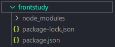
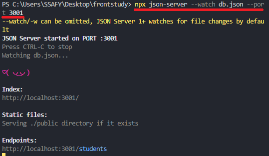
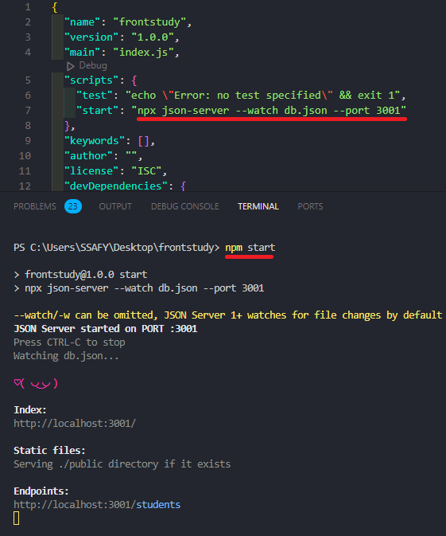
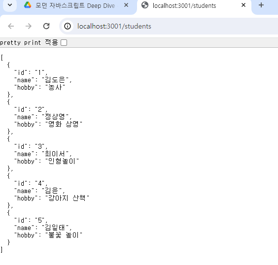
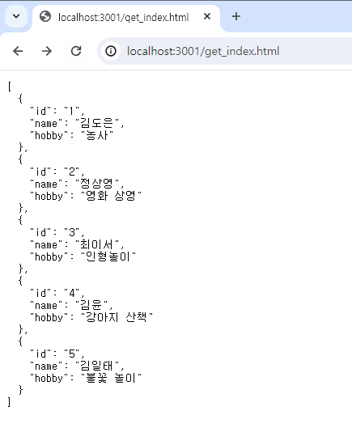
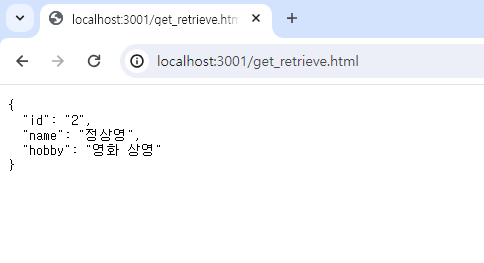

# 44장 REST API 🌙

> REST API : REST를 기반으로 서비스 API를 구현한 것

<br>

> REST : HTTP를 기반으로 클라이언트가 서버의 리소스에 접근하는 방식을 규정한 아키텍처
1. HTTP URI를 통해 Resource(자원)을 명시
2. HTTP Method(POST, GET, PUT, DELETE, PATCH 등)를 사용
3. 해당 자원에 대해 CRUD를 적용하는 것을 의미

REST는 기본적으로 웹의 기존 기술과 **HTTP 프로토콜을 그대로 활용**하기 때문에 **웹의 장점을 최대한 활용할 수 있는 아키텍처 스타일**이다.
   
<br>

> RESTful : REST의 기본 원칙을 성실히 지킨 서비스 디자인

<br>

## 44.1 REST API의 구성

REST API는 자원, 행위, 표현의 3가지 요소로 구성된다. REST는 자체 표현 구조로 구성되어 REST API만으로 HTTP 요청의 내용을 이해할 수 있다.

|구성 요소|내용|표현 방법|
|-|-|-|
|자원|자원|URI|
|행위|자원에 대한 행위|HTTP 요청 메서드|
|표현|자원에 대한 행위의 구체적 내용|페이로드|

```javascript
POST http://www.plusblog.co.kr/users Content-Type: application/json // 헤더 : 페이로드를 해석할 수 있게 명시
{ // 바디
  "username" : "newusers",
  "age" : "20"
}

호스트에 있는 users에 'newuser'라는 사용자를 추가하는 REST API이다.
새로운 유저를 입력하는데 사용자의 특성(이름, 나이, 성별 등)과 같은 정보들이 필요하게 되고,
이는 XML이나 JSON과 같은 다양한 표현 언어를 이용하게 된다.
이런 HTTP 메소드의 정보 표현 부분을 메서드 바디 혹은 페이로드라고 한다
```

<br>

## 44.2 REST API 설계 원칙

REST API 설계 원칙 두 가지는 **URI는 리소스를 표현**하는 데 집중하고 **행위에 대한 정의는 HTTP 요청 메서드**를 통해 하는 것이 설계하는 것이 중요한 규칙

1. URI는 리소스를 표현

리소스를 식별할 수 있는 이름은 동사보다는 명사를 사용하고 이름에 get 같은 행위에 대한 표현이 들어가서는 안 된다.

```
# bad
GET /getTodos/1
GET /todos/show/1

# good
GET /todos/1
```

2. 행위에 대한 정의는 HTTP 요청 메서드로 표현

HTTP 요청 메서드는 클라이언트가 서버에게 요청의 종류와 목적을 알리는 방법이다. 주로 5가지 요청 메서드(GET, POST, PUT, PATCH. DELETE 등)를 사용하여 CRUD를 구현한다.

|HTTP 요청 메서드|종류|목적|페이로드|
|-|-|-|-|
|GET|index/retrieve|모든/특정 리소스 취득|X|
|POST|create|리소스 생성|O|
|PUT|replace|리소스의 전체 교체|O|
|PATCH|modify|리소스의 일부 수정|O|
|DELETE|delete|모든/특정 리소스 삭제|X|

리소스에 대한 행위는 HTTP 요청 메서드를 통해 표현하며 URI에 표현하지 않는다.

```
# bad
GET /todos/delete/1

# good
DELETE /todos/1
```

<br>

## 44.3 JSON Server를 이용한 REST API 실습

#### 44.3.1 JSON Server 설치

```
npm init -y
npm install json-server --save-dev
```
<p align="center"></p> 
<p align="center"></p> 


#### 44.3.2 db.json 파일 생성

프로젝트 루트 폴더에 다음과 같이 db.json 파일을 생성한다.

```javascript
{
    "students":[
        {
            "id": 1,
            "name": "김도은",
            "hobby": "농사"
        },
        {
            "id": 2,
            "name": "정상영",
            "hobby": "영화 상영"
        },
        {
            "id": 3,
            "name": "최이서",
            "hobby": "인형놀이"
        },
        {
            "id": 4,
            "name": "김윤",
            "hobby": "강아지 산책"
        },
        {
            "id": 5,
            "name": "김일태",
            "hobby": "불꽃 놀이"
        }
    ]
}
```

#### 44.3.3 JSON Server 실행

터미널엔 다음과 같이 명령어를 입력하여 JSON Server를 실행한다. JSON Server가 데이터베이스 역할을 하는 db.json 파일의 변경을 감지하게 하려면 watch 옵션을 추가한다.

```
npx json-server --watch db.json --port 3001
//npx는 Node.js 패키지를 실행하고 관리하는 도구이고 json-server가 전역으로 설처된게 아니라서 적어주기
```
<p align="center"></p> 

하지만 매번 다음과 같은 명령어를 입력하는 것은 번거로우기 때문에 package.json파일에서 scripts를 수정하면 더욱 빠르게 실행시킬 수 있다.

<p align="center"></p> 

링크 클릭 시 다음과 같이 확인할 수 있다.

<p align="center"></p> 

#### 44.3.4 GET 요청

리소스에서 전체 데이터를 취득하고 싶으면 GET 요청을 하면 된다.

루트폴더에 get_index.html을 다음과 같이 추가하면 된다. 

```html
<!DOCTYPE html>
<html lang="ko">
<body>
    <pre></pre>
    <script>
        // XMLHttpRequest 객체 생성
        const xhr = new XMLHttpRequest();
        // HTTP 요청 초기화
        // students 리소스에서 모든 students를 취득(index)
        xhr.open('GET','/students');

        // HTTP 요청 전송
        xhr.send();

        // load 이벤트는 요청이 성공적으로 완료된 경우 발생한다.
        xhr.onload = () => {
            // status 프로퍼티 값이 200이면 정상적으로 응답된 상태다.
            if (xhr.status == 200) {
                document.querySelector('pre').textContent = xhr.response;
            } else {
                console.error('Error', xhr.status, xhr.statusText);
            }
        };
    </script>
</body>
</html>
```

브라우저에서 http://localhost:3000/get_index.html로 접속하면 확인할 수 있다.
<p align="center"></p> 

id를 사용하여 특정 데이터만 취득하고 싶으면 다음과 같이 추가하면 된다. 
```html
<!DOCTYPE html>
<html lang="ko">
<body>
    <pre></pre>
    <script>
        // XMLHttpRequest 객체 생성
        const xhr = new XMLHttpRequest();
        // HTTP 요청 초기화
        // students 리소스에서 id를 사용하여 특정 student를 취득(index)
        xhr.open('GET','/students/2');

        // HTTP 요청 전송
        xhr.send();

        // load 이벤트는 요청이 성공적으로 완료된 경우 발생한다.
        xhr.onload = () => {
            // status 프로퍼티 값이 200이면 정상적으로 응답된 상태다.
            if (xhr.status == 200) {
                document.querySelector('pre').textContent = xhr.response;
            } else {
                console.error('Error', xhr.status, xhr.statusText);
            }
        };
    </script>
</body>
</html>
```

브라우저에서 http://localhost:3000/get_retrieve.html로 접속하면 확인할 수 있다.
<p align="center"></p> 

#### 44.3.5 POST 요청

```javascript

```

#### 44.3.6 PUT 요청

```javascript

```

#### 44.3.7 PATCH 요청

```javascript

```

#### 44.3.8 DELETE 요청

```javascript

```
