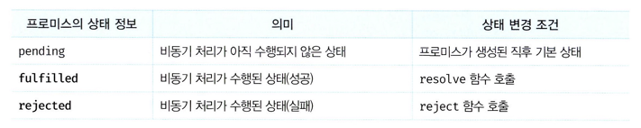
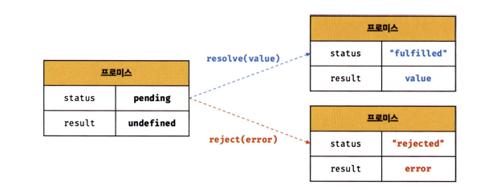
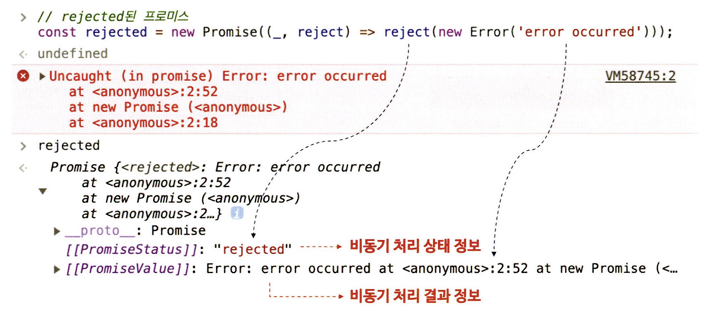
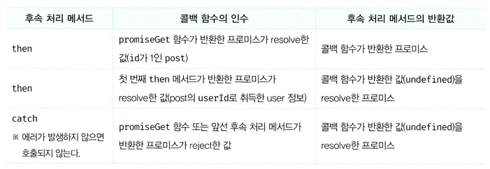

# 45. 프로미스
자바스크립트는 비동기 처리를 위한 하나의 패턴으로 콜백 함수를 사용하나, 전통적인 콜백 패턴은 콜백 헬로 인해 가독성이 나쁘고 에러의 처리가 곤란하며 여러 개의 비동기 처리를 한 번에 처리하기에 한계가 있다.

이를 처리하기 위해 ES6에서는 프로미스를 도입했다. 프로미스는 전통적인 콜백 패턴이 가진 단점을 보완하며 비동기 처리 시점을 명확하게 표현할 수 있다는 장점이 있다.

## 45-1. 비동기 처리를 위한 콜백 패턴의 단점
### 1️⃣ 콜백 헬
```javascript
// GET 요청을 위한 비동기 함수
const get = url => {
    const xhr = new XMLHttpRequest();
    xhr.open('GET , url');
    xhr.send();

    xhr.onload =()=> {
        if (xhr.status === 200) {
            // 서버의 응답을 콘솔에 출력한다.
            console.log(JSON.parse(xhr.response));
        } else {
            console.error( ${xhr.status} ${xhr.statusText}');
        }
    };
};
// id가 1°! post를 취득
get('https://jsonplaceholder.typicode.com/posts/11');
/*
{
    "userid": 1,
    "id": 1,
    "title": "sunt aut facere ... ",
    "body": "quia et suscipit "
}
★/
```
get함수는 비동기 함수로, 함수 내부에 비동기로 동작하는 코드를 포함한다. **비동기 함수를 호출하면 함수 내부의 비동기로 동작하는 코드가 완료되지 않았다 해도 기다리지 않고 즉시 종료된다. 즉, 비동기 함수 내부의 비동기로 동작하는 코드는 비동기 함수가 종료된 이후에 완료된다. 따라서 비동기 함수 내부의 비동기로 동작하는 코드에서 처리 결과를 외부로 반환하거나 상위 스코프의 변수에 할당하면 기대한 대로 동작하지 않는다.**

GET 요청을 전송하고 서버의 응답을 전달받는 get 함수도 내부의 onload 이벤트 핸들러 때문에 비동기 함수다. get 함수를 호출하면 GET 요청을 전송하고 onload 이벤트 핸들러를 등록한 다음 undefined를 반환하고 즉시 종료된다. 즉, 비동기 함수인 get 함수 내부의 onload 이벤트 핸들러는 get 함수가 종료된 이후에 실행된다. 따라서 get 함수의 onload 이벤트 핸들러에서 서버의 응답 결과를 반환하거나 상위 스코프의 변수에 할당하면 기대한 대로 동작하지 않는다.

만약 서버의 응답을 상위 스코프의 변수에 할당하면 어떨까?

```javascript
let todos;
// GET 요청을 위한 비동기 함수
const get = url => {
    const xhr = new XMLHttpRequest();
    xhr.open('GET', url);
    xhr.send();

    xhr.onload = () => {
        if (xhr.status === 200) {
            // 1. 서버의 응답을 상위 스코프의 변수에 할당한다.
            todos = JSON.parse(xhr.response);
        } else {
            console.error( ${xhr.status} ${xhr.statusText} );
        }
    };
};
// id가 1인 post를 취득
get('https://jsonplaceholder.typicode.com/posts/1');
console.log(todos); // 2. undefined
```
이 또한 기대한 대로 동작하지 않는다. xhr.onload 이벤트 핸들러 프로퍼티에 바인딩한 이벤트 핸들러는 언제나 2의 console.log가 종료한 이후에 호출된다. 따라서 (2)의 시점에는 아직 전역 변수 todos에 서버의 응답 결과가 할당되기 이전이다. 다시 말해, xhr.onload 이벤트 핸들러에서 서버의 응답을 상위 스코프의 변수에 할당(1)하면 처리 순서가 보장되지 않는다.

1. get 함수 실행 → get 함수의 실행 컨택스트 스택에 push, 이벤트 핸들러 바인딩
2. get 함수의 실행 컨택스트 pop → (2)의 console.log 호출 → console.log의 실행 컨택스트 스택에 push
3. 응답이 도착하면 xhr 객체에서 load 이벤트 발생 → **xhr.onload 핸들러 프로퍼티에 바인딩한 이벤트 핸들러가 즉시 실행되는 것이 아니다. xhr.onload 이벤트 핸들러는 load 이벤트가 발생하면 일단 태스크 큐에 저장되어 대기하다가, 콜 스택이 비면 이벤트 루프에 의해 콜 스택으로 푸시되어 실행된다.**
4. xhr.onload 이벤트 핸드러는 모든 console.log가 종료된 이후에 실행 → undefined

**이처럼 비동기 함수는 비동기 처리 결과를 외부에 반환할 수 없고. 상위 스코프의 변수에 할당할 수도 없다. 따라서 비동기 함수의 처리 결과(서버의 응답 등)에 대한 후속 처리는 비동기 함수 내부에서 수행해야 한다. 이때 비동기 함수를 범용적으로 사용하기 위해 비동기 함수에 비동기 처리 결과에 대한 후속 처리를 수행하는 콜백 함수를 전달하는 것이 일반적이다. 필요에 따라 비동기 처리가 성공하면 호출될 콜백 함수와 비동기 처리가 실패하면 호출될 콜백 함수를 전달할 수 있다.**

```javascript
// GET 요청을 위한 비동기 함수
const get = (url, successcallback, failurecallback) => {
    const xhr = new XMLHttpRequest();
    xhr.open('GET', url);
    xhr.send();

    xhr.onload =()=>{
        if (xhr.status === 200) {
            // 서버의 응답을 콜백 함수에 인수로 전달하면서 호출하여 응답에 대한 후속 처리를 핸다.
            successCallback(JSON.parse(xhr.response));
        } else {
            // 에러 정보를 콜백 함수에 인수로 전달하면서 호출하여 에러 처리를 한다.
            failureCallback(xhr.status);
        }
    };
};

// id가 1인 post를 취득
// 서버의 응답에 대한 후속 처리를 위한 콜백 함수를 비동기 함수인 get에 전달해야 한다.
get('https://jsonplaceholder.typicode.eom/posts/l', console.log, console.error);
/*
{
    "userid": 1,
    "id": 1,
    "title": "sunt aut facere ... ",
    "body": "quia et suscipit ... "
}
*/
```
이처럼 콜백 함수를 통해 비동기 처리 결과에 대한 후속 처리를 수행하는 비동기 함수가 비동기 처리 결과를 가지고 또다시 비동기 함수를 호출해야 한다면 콜백 함수 호출이 중첩되어 복잡도가 높아지는 현상이 발생하는데. 이를 **콜백 헬**이 라 한다.

다음은 콜백 헬이 발생하는 전형적인 사례다.

```javascript
get('/stepl1', a => {
    get(`/step2/${a}`, b => {
        get(`/step3/${b}`, c => {
            get(`/step4/${c}`, d => {
                console.log(d);
            });
        });
    });
});
```

### 2️⃣ 에러 처리의 한계
```javascript
try {
    setTimeout(() => { throw new Error('Error!'); }, 1000);
} catch (e) {
    // 에러를 캐치하지 못한다
    console.error('캐치한 에러', e);
}
```
비동기 처리를 위한 콜백 패턴의 문제점 중에서 가장 심각한 것은 에러 처리가 곤란하다는 것이다.

try 코드 블록 내에서 호출한 setTimeout 함수는 1초 후에 콜백 함수가 실행되도록 타이머를 설정하고. 이후 콜백 함수는 에러를 발생시킨다. 하지만 이 에러는 catch 코드 블록에서 캐치되지 않는다.

**에러는 호출자 방향으로 전파된다.** 즉, 콜 스택의 아래 방향(실행 중인 실행 컨텍스트가 푸시되기 직전에 푸시된 실행 컨텍스트 방향)으로 전파된다. 하지만 앞에서 살펴본 바와 같이 setTimeout 함수의 콜백 함수를 호출한 것은 setTimeout 함수가 아니다. 따라서 setTimeout 함수의 콜백 함수가 발생시킨 에러는 catch 블록에서 캐치되지 않는다.

## 45-2. 프로미스의 생성
Promise 생성자 함수를 new 연산자와 함께 호출하면 프로미스（Promise 객체）를 생성한다. ES6에서 도입된 Promise는 호스트 객체가 아닌 ECMAScript 사양에 정의된 표준 빌트인 객체다.

Promise 생성자 함수는 비동기 처리를 수행할 콜백 함수를 인수로 전달받는데 이 콜백 함수는 resolve와 reject 함수를 인수로 전달받는다

```javascript
// 프로미스 생성
const promise = new Promise((resolve, reject) => {
    // Promise 함수의 콜백 함수 내부에서 비동기 처리를 수행한다.
    if (/* 비동기 처리 성공 */) { 
        resolve('result');
    } else { /* 비동기 처리 실패 */ 
        reject('failure reason');
    }
})
```
Promise 생성자 함수가 인수로 전달받은 콜백 함수 내부에서 비동기 처리를 수행한다. 이때 비동기 처리가 성공하면 콜백 함수의 인수로 전달받은 resolve 함수를 호출하고, 비동기 처리가 실패하면 reject 함수를 호출한다.

```javascript
// GET 요청을 위한 비동기 함수
const promiseGet = url => {
    return new Promise((resolve, reject) => {
        const xhr = new XMLHttpRequest();
        xhr.open('GET', url);
        xhr.send();

        xhr.onload = () => {
            if (xhr.status === 200) {
                // 성공적으로 응답을 전달받으면 resolve 함수를 호출한다.
                resolve(JSON.parse(xhr.response));
            } else {
                // 에러 처리를 위해 reject 함수를 호출한다.
                reject(new Error(xhr.states)); 
            } 
        };  
    }); 
};

// promiseGet 함수는 프로미스를 반환한다.
 promiseGet('https://jsonplaceholder.typicode.com/posts/1')
```
이는 앞서 살펴본 비동기 함수 get을 프로미스를 사용해 다시 구현한 것이다.

비동기 함수인 promiseGet은 함수 내부에서 프로미스를 생성하고 반환한다. 비동기 처리는 Promise 생성자 함수가 인수로 전달받은 콜백 함수 내부에서 수행한다. 만약 비동기 처리가 성공하면 비동기 처리 결과를 resolve 함수에 인수로 전달하면서 호출하고, 비동기 처리가 실패하면 에러를 reject 함수에 인수로 전달하면서 호출한다.

<p align="center"></p>

프로미스는 다음과 같이 현재 비동기 처리가 어떻게 진행되고 있는지를 나타내는 상태 정보를 갖는다.

<p align="center"></p>

fulfilled 또는 rejected 상태를 settled 상태라고 한다. settled 상태는 fulfilled 또는 rejected 상태와 상관없이 pending이 아닌 상태로 비동기 처 리가 수행된 상태를 말한다.

프로미스는 pending 상태에서 fulfilled 또는 rejected 상태, 즉 settled 상태로 변화할수 있다. 하지만 일단 settled 상태가 되면 더는 다른 상태로 변화할 수 없다

<p align="center"></p>
<p align="center"></p>

비동기 처리가 성공하면 프로미스는 pending 상태에서 fulfilled 상태로 변화한다. 그리고 비동기 처리 결과인 1을 값으로 갖는다. 비동기 처리가 실패하면 프로미스는 pending 상태에서 rejected 상태로 변화한다. 그리고 비동기 처리 결과인 Error 객체를 값으로 갖는다. 즉, **프로미스는 비동기 처리 상태와 처리 결과를 관리하는 객체다.**

## 45-3. 프로미스의 후속 처리 메서드
프로미스의 비동기 처리 상태가 변화하면 이에 따른 후속 처리를 해야 한다. 이를 위해 프로미스는 후속 메서드 then, catch, finally를 제공한다. **프로미스의 비동기 처리 상태가 변화하면 후속 처리 메서드에 인수로 전달한 콜백 함수가 선택적으로 호출된다.**

### 1️⃣ Promise.prototype.then
then 메서드는 두 개의 콜백 함수를 인수로 전달받는다.

- 첫 번째 콜백 함수는 프로미스가 fulfilled 상태(resolve 함수가 호출된 상태)가 되면 호출된다. 이때 콜백 함수는 프로미스의 비동기 처리 결과를 인수로 전달받는다.
- 두 번째 콜백 함수는 프로미스가 rejected 상태(reject 함수가 호출된 상태)가 되면 호출된다. 이때 콜브넉 함수는 프로미스의 에러를 인수로 전달받는다.

즉, 첫 번째 콜백 함수는 비동기 처리가 성공했을 때 호출되는 성공 처리 콜백 함수이며, 두 번째 콜백 함수는 비동기 처리가 실패했을 때 호출되는 실패 처리 콜백 함수다.

```javascript
// fulfilled
new Promise(resolve => resolve('fulfilled'))
    .then(v => console.log(v), e => console.error(e)); // fulfilled
 // rejected
new Promise((_, reject) => reject(new Error('rejected')))
    .then(v => console.log(v), e => console.error(e)); // Error: rejected
```
then 메서드는 언제나 프로미스를 반환한다. 만약 then 메서드의 콜백 함수가 프로미스를 반환하면 그 프로미스를 그대로 반환하고, 콜백 함수가 프로미스가 아닌 값을 반환하면 그 값을 암묵적으로 resolve 또는 reject하여 프로미스를 생성해 반환한다.

### 2️⃣ Promise.prototype.catch
catch 메서드는 한 개의 콜백 함수를 인수로 전달받는다. catch 메서드의 콜백 함수는 프로미스가 rejected 상태인 경우만 호출된다.

```javascript
// rejected
new Promise((_, reject) => reject(new Error('rejected'))) 
    .catch(e => console.log(e)); // Error: rejected

 // rejected
new Promise((_, reject) => reject(new Error('rejected')))
    .then(undefined, e => console.log(e)); // Error: rejected
```
catch 메서드는 then(undefined, onRejected)과 동일하게 동작한다. 따라서 then 메서드와 마찬가지로 언제나 프로미스를 반환한다

### 3️⃣ Promise.prototype.finally
finally 메서드는 한 개의 콜백 함수를 인수로 전달받는다. finally 메서드의 콜백 함수는 프로미스의 성공(fulfilled) 또는 실패(rejected)와 상관없이 무조건 한 번 호출된다. finally 메서드는 프로미스의 상태와 상관없이 공통적으로 수행해야 할 처리 내용이 있을 때 유용하다. finally 메서드도 then/catch 메서드와 마찬가지로 언제나 프로미스를 반환한다.

```javascript
new Promise(() => {})
    .finally(() => console.log('finally')); // finally
```

프로미스로 구현한 비동기 함수 get을 사용해 후속 처리를 구현하면 다음과 같다.

```javascript
const promiseGet = url => {
    return new Promise((resolve, reject) => {
        const xhr = new XMLHttpRequest();
        xhr.open('GET', url);
        xhr.send();
        
        xhr.onload = () => {
            if (xhr.status === 200) {
                // 성공적으로 응답을 전달받으면 resolve 함수를 호출한다.
                resolve(JSON.parse(xhr.response)); 
            } else {
                // 에러 처리를 위해 reject 함수를 호출한다.
                reject(new Error(xhr.status));
            }
        };
    });
};

// promiseGet 함수는 프로미스를 반환한다.
promiseGet('https://jsonplaceholder.typicode.eom/posts/1')
    .then(res => console.log(res))
    .catch(err => console.error(err))
    .finally(() => console.log('Bye!'));
```

## 45-4. 프로미스의 에러 처리
비동기 처리를 위한 콜백 패턴은 에러 처리가 곤란하다는 문제가 있는데, 프로미스를 활용하면 이를 문제없이 처리할 수 있다.

위 예제의 비동기 함수 get은 프로미스를 반환한다. 비동기 처리 결과에 대한 후속 처 리는 프로미스가 제공하는 후속 처리 메서드 then, catch, finally를 사용하여 수행한다.

비동기 처리에서 발생한 에러는 then 메서드의 두 번째 콜백 함수로 처리할 수 있다. 혹은 catch 메서드를 호출하여 사용할 수 있다. 단, then 메서드의 두 번째 콜백 함수는 첫 번째 콜백 함수에서 발생한 에러를 캐치하지 못하고 코드가 복잡해져서 가독성이 좋지 않다. 따라서 에러 처리는 then 메서드에서 하지 말고 catch 메서드에서 하는 것을 권장한다.

```javascript
promiseGet('https://jsonplaceholder.typicode.com/todos/1') 
    .then(res => console.xxx(res))
    .catch(err => console.error(err)); // TypeError: console.xxx is not a function
```

## 45-5. 프로미스의 체이닝
비동기 처리를 위한 콜백 패턴은 콜백 헬이 발생하는 문제가 있다. 프로미스는 then, catch, finally 후속 처리 메서드를 통해 콜백 헬을 해결한다.

```javascript
const url = 'https://jsonplaceholder.typicode.com';

// id가 1 인 post의 userid를 취득
promiseGet('${url}/posts/1')
    // 취득한 post의 userid^. 니ser 정보를 취득
    .then(({ userid }) => promiseGet(`${url}/users/${userld}`))
    .then(userlnfo => console.log(userInfo))
    .catch(err => console.error(err));
```
위 예제에서 then → then → catch 순서로 후속 처리 메서드를 호출했다. then, catch, finally 후속 처리 메서드는 언제나 프로미스를 반환하므로 연속적으로 호출할 수 있다. 이를 프로미스 체이닝이라 한다.

<p align="center"></p>

이처럼 then, catch, finally 후속 처리 메서드는 콜백 함수가 반환한 프로미스를 반환한다. 만약 후속 처리 메서드의 콜백 함수가 프로미스가 아닌 값을 반환하더라도 그 값을 암묵적으로 resolve 또는 reject하여 프로미스를 생성해 반환한다.

프로미스는 프로미스 체이닝을 통해 비동기 처리 결과를 전달받아 후속 처리를 하므로 비동기 처리를 위한 콜백 패턴에서 발생하던 콜백 헬이 발생하지 않는다. 다만 프로미스도 콜백 패턴을 사용하므로 콜백 함수를 사용하지 않는 것은 아니다.

콜백 패턴은 가독성이 좋지 않다. 이 문제는 ES8에서 도입된 async/await를 통해 해결할 수 있다. async/await를 사용하면 프로미스의 후속 처리 메서드 없이 마치 동기 처리처럼 프로미스가 처리 결과를 반환하도록 구현할 수 있다.

## 45-6. 프로미스의 정적 메서드
Promise는 주로 생성자 함수로 사용되지만 함수도 객체이므로 메서드를 가질 수 있다. Promise는 5가지 정적 메서드를 제공한다.

### 1️⃣ Promise.resolve / Promise.reject
Promise.resolve와 Promise.reject 메서드는 이미 존재하는 값을 래핑하여 프로미스를 생성하기 위해 사용한다. Promise.resolve 메서드는 인수로 전달받은 값을 resolve하는 프로미스를 생성한다. Promise.reject 메서드는 인수로 전달받은 값을 reject하는 프로미스를 생성한다.

```javascript
// 배열을 resolve하는 프로미스를 생성
const resolvedPromise = Promise.r은solve([1, 2, 3]);
resolvedPromise.then(console.log); // [1, 2, 3]

// 에러 객체를 reject하는 프로미스를 생성
const rejectedPromise = Promise.reject(new Error('Error!'));
rejectedPromise.catch(console/Log); // Error: Error!
```

### 2️⃣ Promise.all
Promise.all 메서드는 여러 개의 비동기 처리를 모두 병렬 처리할 때 사용한다.

```javascript
const requestDatal = () =>
    new Promise(resolve => setTimeout(() => resolve(l), 3000));
const requestData2 = () =>
    new Promise(resolve => setTimeout(() => resolve(2), 2000));
const requestData3 = () =>
    new Promise(resolve => setTimeout(() => resolve(3), 1000));

// 서/ 개의 비동기 처리를 병렬로 처리
Promise.all([requestData1(), requestData2(), requestData3()]) 
    .then(console.log) // [ 1, 2, 3 ] → 약 3초 소요 
    .catch(console.error);
```
Promise.all 메서드는 프로미스를 요소로 갖는 배열 등의 이터러블을 인수로 전달받는다. 그리고 전달받은 모든 프로미스가 모두 fulfilled 상태가 되면 모든 처리 결과를 배열에 저장해 새로운 프로미스를 반환한다.

- 첫 번째 프로미스는 3초 후에 1을 resolve한다.
- 두 번째 프로미스는 2초 후에 2를 resolve한다.
- 세 번째 프로미스는 1초 후에 3을 resolve한다.

Promise.all 메서드는 인수로 전달받은 배열의 모든 프로미스가 모두 fulfilled 상태가 되면 종료한다. 따라서 Proniise.aU 메서드가 종료하는 데 걸리는 시간은 가장 늦게 fulfilled 상태가 되는 프로미스의 처리 시간보다 조금 더 길다.

모든 프로미스가 fulfilled 상태가 되면 resolve된 처리 결과{위 예제의 경우 1, 2, 3)를 모두 배열에 저장해 새로운 프로미스를 반환한다. 이때 첫 번째 프로미스가 가장 나중에 fulfilled 상태가 되어도 Promise.all 메서드는 첫 번째 프로미스가 resolve한 처리 결과부터 차례대로 배열에 저장해 그 배열을 resolve하는 새로운 프로미스를 반환한다. 즉, 처리 순서가 보장된다.

Promise.all 메서드는 인수로 전달받은 배열의 프로미스가 하나라도 rejected 상태가 되면 나머지 프로미스가 fulfilled 상태가 되는 것을 기다리지 않고 즉시 종료한다.

### 3️⃣ Promise.race
Promise.race 메서드는 Promise.all 메서드와 동일하게 프로미스를 요소로 갖는 배열 등의 이터러블을 인수로 전달받는다. Promise.race 메서드는 Promise.all 메서드처럼 모든 프로미스가 fulfilled 상태가 되는 것을 기다리는 것이 아니라 가장 먼저 fulfilled 상태가 된 프로미스의 처리 결과를 resolve하는 새로운 프로미스를 반환한다.

```javascript
Promise.race([
    new Promise(resolve => setTimeout(() => resolve(1), 3000)), // 1
    new Promise(resolve => setTimeout(() => resolve(2), 2000)), // 2
    new Promise(resolve => setTimeout(() => resolve(3), 1000)) // 3
])
    .then(console.log) // 3
    .catch(console.log);
```

프로미스가 rejected 상태가 되면 Promise.all 메서드와 동일하게 처리된다. 즉. Promise.race 메서드에 전달된 프로미스가 하나라도 rejected 상태가 되면 에러를 reject하는 새로운 프로미스를 즉시 반환한다.

```javascript
Promise.race([
    new Promise((_, reject) => setTimeout(() => reject(new Error('Error 1')), 3000))
    new Promise((_, reject) => setTimeout(() => reject(new Error('Error 2')), 3000))
    new Promise((_, reject) => setTimeout(() => reject(new Error('Error 3')), 3000))
])
    .then(console.log)
    .catch(console.log); // Error: Error 3
```

### 4️⃣ Promise.allSettled
Promise.aUSettled 메서드는 프로미스를 요소로 갖는 배열 등의 이터러블을 인수로 전달받는다. 그리고 전달받은 프로미스가 모두 settled 상태(비동기 처리가 수행된 상태. 즉 fulfilled 또는 rejected 상태)가 되면 처리 결과를 배열로 반환한다.

```javascript
Promise.allSettled([
    new Promise(resolve => setTimeout(() => resolve(1), 2000)),
    new Promise((_, reject) => setTimeout(() => reject(new Error('Error!')), 1000)) 
]).then(console.log);
/*
[
    {status: "fulfilled”, value: 1},
    {status: "rejected", reason: Error: Error! at <anonymous>：3：54}
]
★/
 
```
Promise.aUSettled 메서드가 반환한 배열에는 fulfilled 또는 rejected 상태와는 상관없이 Promise.allSettled 메서드가 인수로 전달받은 모든 프로미스들의 처리 결과가 모두 담겨 있다. 프로미스의 처리 결과를 나타내는 객체는 다음과 같다.

- 프로미스가 fulfilled 상태인 경우 비동기 처리 상태를 나타내는 status 프로퍼티와 처리 결과를 나타내는 value 프로퍼티를 갖는다.
- 프로미스가 rejected 상태인 경우 비동기 처리 상태를 나타내는 status 프로퍼티와 에러를 나타내는 reason 프로퍼티를 갖는다.

## 45-6. 프로미스의 정적 메서드

## 45-7. 마이크로태스크 큐
```javascript
setTimeout(() => console.log(l), 0);

Promise.resolve()
    .then(() => console.log(2))
    .then(() => console.log(3));
```
프로미스의 후속 처리 메서드도 비동기로 동작하므로 1→2→3의 순으로 출력될 것처럼 보이지만 2→3→1의 순으로 출력된다. 그 이유는 프로미스의 후속 처리 메서드의 콜백 함수는 태스크 큐가 아니라 마이크로태스크 큐에 저장되 기 때문이다

마이크로태스크 큐는 태스크 큐와는 별도의 큐다. 마이크로태스크 큐에는 프로미스의 후속 처리 메서드의 콜백 함수가 일시 저장된다. 그 외의 비동기 함수의 콜백 함수나 이벤트 핸들러는 태스크 큐에 일시 저장된다.

콜백 함수나 이벤트 핸들러를 일시 저장한다는 점에서 태스크 큐와 동일하지만 **마이크로태스크 큐는 태스크 큐보다 우선순위가 높다.** 즉, 이벤트 루프는 콜 스택이 비면 먼저 마이크로태스크 큐에서 대기하고 있는 함수를 가져와 실행한다. 이후 마이크로태스크 큐가 비면 태스크 큐에서 대기하고 있는 함수를 가져와 실행한다.

## 45-8. fetch
fetch 함수는 XMLHttpRequest 객체와 마찬가지로 HTTP 요청 전송 기능을 제공하는 클라이언트 사이드 Web API다. fetch 함수는 XMLHttpRequest 객체보다 사용법이 간단하고 프로미스를 지원하기 때문에 비동기 처리를 위한 콜백 패턴의 단점에서 자유롭다.

**fetch 함수는 HTTP 응답을 나타내는 Response 객체를 래핑한 Promise 객체를 반환한다.** fetch 함수로 GET 요청을 전송해 보자. fetch 함수에 첫 번째 인수로 HTTP 요청을 전송할 URL만 전달하면 GET 요청을 전송한다.

```javascript
fetch('https://jsonplaceholder.typicode.eom/todos/1')
    .then(response => console.log(response));
```

fetch 함수는 HTTP 응답을 나타내는 Response 객체를 래핑한 프로미스를 반환하므로 후속 처리 메서드 then을 통해 프로미스가 resolve한 Response 객체를 전달받을 수 있다. Response 객체는 HTTP 응답을 나타내는 다양한 프로퍼티를 제공한다.

<p align="center"></p>

fetch 함수를 통해 HTTP 요청을 전송해보자. fetch 함수에 첫 번째 인수로 HTTP 요청을 전송할 URL과 두 번째 인수로 HTTP 요청 메서드, HTTP 요청 헤더. 페이로드 등을 설정한 객체를 전달한다.

```javascript
const request = { 
    get(url) {
        return fetch(url);
    },
    post(url, payload) { 
        return fetch(url, { 
            method: 'POST', 
            headers: { 'content-Type': 'application/json' }, 
            body: JSON.stringify(payload)
        })；
    },
    patch(url, payload) { 
        return fetch(url, { 
            method: 'PATCH', 
            headers: { 'content-Type': 'application/json' }, 
            body: JSON.stringify(payload)
        })；
    },
    delete(url) {
        return fetch(url, { method: 'DELETE' });
    }
};
```